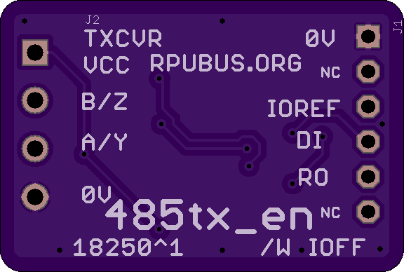

# 485tx_en Hardware

## Overview

Waring: this board is not industry-standard RS485.

The THVD150 is one of the new transceivers that have a 50mV built-in fail-safe margin, so they see everything on the differential pair (A/B) that is higher than -50mV as a HIGH. Between -50mV and -200mV is undefined and bellow -200mV is a LOW. These devices see 0V on the pair as a HIGH. The old standard is undefined in the range 200mV to -200mV. Other chips that do this include ISL3172 and MAX3085.

If 0V between A/B is guaranteed to be seen as a HIGH, then why do I need to drive it? I do not, but let's be clear I am not using the RS485 standard.

When a UART TX line is at rest it is a digital HIGH. If I use the digital high to disable the transmitter and all the receivers see 0V as HIGH then communication will work. The possibility of software caused self-destructing cross conduction is eliminated (unfortunately the A/B hardware wires can still be swapped).

The RX line will receive everything placed on the media and it is enabled by default with a pull-up. This can be unexpected depending on previous experience. It is dealt with by software reading back the sent characters. The readback can be used to see if the A/B pair has a short circuit, or if a collision is occurring (e.g. two or more drivers).  

IOFF buffers are also added so any MCU voltage can be used.

This is how the out of band manager communicates between nodes on my projects (e.g. [rpubus]).

[rpubus]: https://rpubus.org/

Since the receiver remains activated when the transmitter is enabled the UART will get an echo of what it puts on the differential pair, in short, this means a hardware UART is required since software serial cannot deal with both TX and RX happening at the same time.


## Inputs/Outputs/Functions

```
        RS485 transceiver with builtin fail-safe 
        Push to talk control (DE) is done with inverted TX.
```


## Uses

```
        Half Duplex serial
```


# Table Of Contents

1. [Status](#status)
2. [Design](#design)
3. [Bill of Materials](#bill-of-materials)
4. [How To Use](#how-to-use)


# Status


```
        ^0  Done: Design, Layout, BOM, 
            WIP: Review*,
            Todo: Order Boards, Assembly, Testing, Evaluation.
            *during review the Design may change without changing the revision.
```

Debugging and fixing problems i.e. [Schooling](./Schooling/)

Setup and methods used for [Evaluation](./Evaluation/)


# Design

The board is 0.063 thick, FR4, two layer, 1 oz copper with ENIG (gold) finish.




## Electrical Schematic


## Testing

Check correct assembly and function with [Testing](./Testing/)


# Bill of Materials

The BOM is a CVS file(s), import it into a spreadsheet program like LibreOffice Calc (or Excel), or use a text editor.

Option | BOM's included
----- | ----- 
A. | [BRD] 
M. | [BRD] [SMD] [HDR] 
W. | [BRD] [SMD] [HDR] [PLUG]

[BRD]: ./Design/18250BRD,BOM.csv
[SMD]: ./Design/18250SMD,BOM.csv
[HDR]: ./Design/18250HDR,BOM.csv
[PLUG]: ./Design/18250PLUG,BOM.csv


# How To Use

Connect UART_RX (whcih goes to RO), UART_TX (which goes to DI), and UART power (0V and IOREF). The Receiver enable is logic low (with a bar over RE, or nRE), it has a 3k Ohm pull-down resistor. The Transmitter enable (DE) has a 3k Ohm pull-up, but is also pulled low with an NPN whose base is controlled with the UART TX. The push to talk lines (DE and nRE) are hard-wired, but unless the UART TX is sending data the bus is free to use by other devices. 

If the power to the transceiver is turned off the bus is free to use by other devices (and not locked up). If the power to the UART is removed the IOFF buffer will go into its HI-Z state (which is the IOFF feature), and if the transceiver still is powered it will be set up so the bus is free to use by other devices.


# Other Tx Enable

Some of the Sparkfun boards done by LinkSprite did this, but they also turn off the receive which was not what I wanted. 

* https://cdn.sparkfun.com/datasheets/Dev/Arduino/Shields/RS485_schematics.pdf


