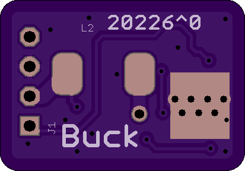
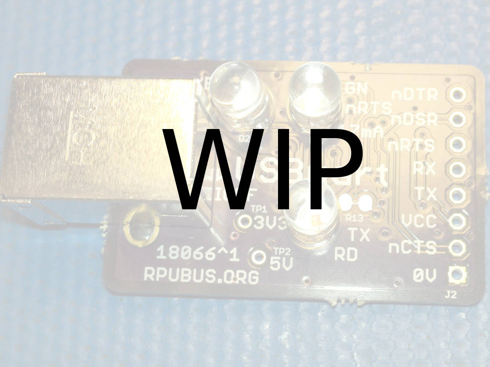
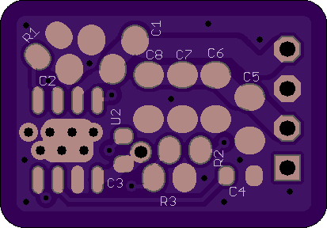
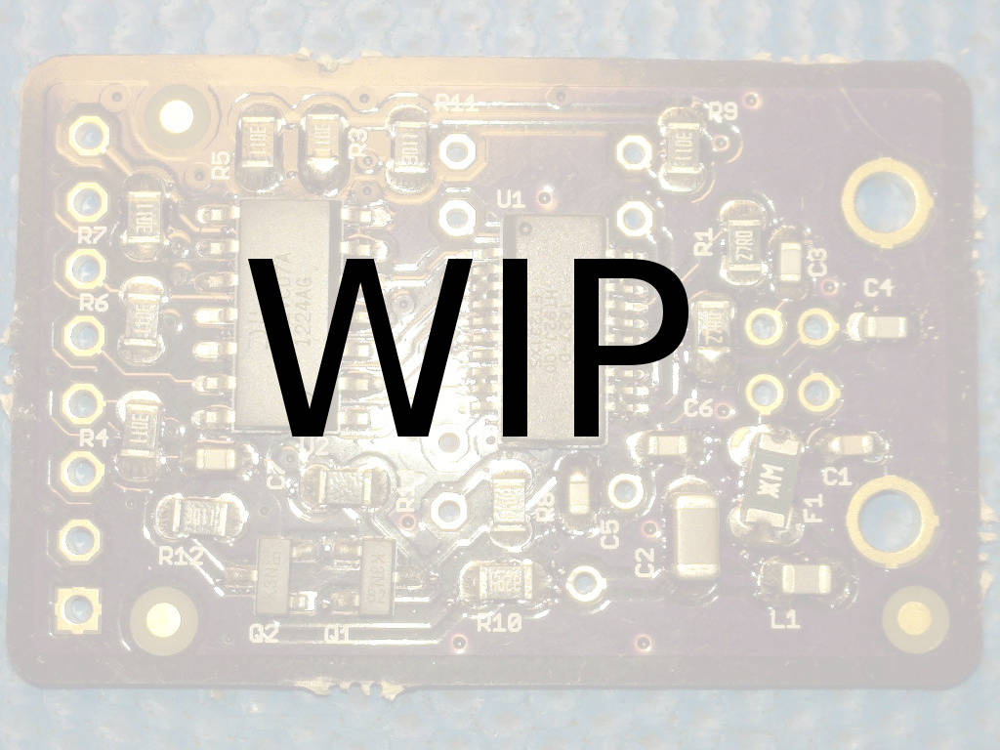
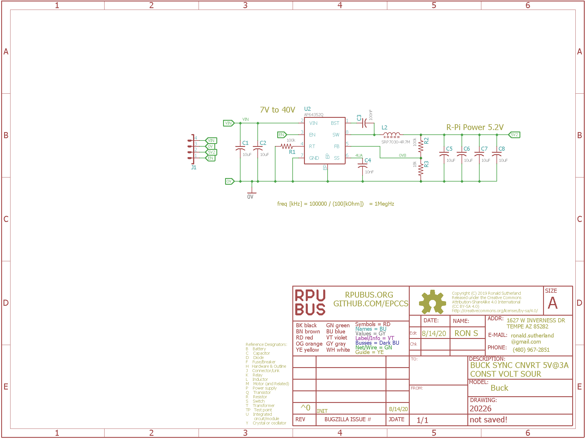

# Buck Hardware

## Overview

Point of Load (POL) switch-mode power supply (SMPS) that has a broad input (8V to 40V) synchronous buck converter setup for output of 5V@3A. The R-Pi host that mounts on my control boards needs 3A at 5V; the Diodes AP64352Q is a good fit.


## Inputs/Outputs/Functions

```
        5V setpoint
        3A load
```


## Uses

```
        Power for a R-Pi4
        Convert 12V or 24V battery power systems into 5V.
```


# Table Of Contents

1. [Status](#status)
2. [Design](#design)
3. [Bill of Materials](#bill-of-materials)
4. [How To Use](#how-to-use)


# Status

[Options](#bill-of-materials)


```
        ^0  Done: Design (#=done), Layout, BOM, 
            WIP: Review*,
            Todo: Order Boards, Assembly, Testing, Evaluation.
            *during review the Design may change without changing the revision.
            # AP64352Q is a wide input (8V to 40V) switch mode CV synchronous buck converter.
            # SRP7028A-4R7M is a 4.7uH inductor with 5.5Arms and 40 mOhm Max
```

Debugging and fixing problems i.e. [Schooling](./Schooling/)

Setup and methods used for [Evaluation](./Evaluation/)


# Design

The board is 0.063 thick, FR4, two layer, 1 oz copper with ENIG (gold) finish.







## Electrical Schematic



## Testing

Check correct assembly and function with [Testing](./Testing/)


# Bill of Materials

The BOM is a CVS file(s), import it into a spreadsheet program like LibreOffice Calc (or Excel), or use a text editor.

Option | BOM's included
----- | ----- 
A. | [BRD] 
M. | [BRD] [SMD] [HDR] 

[BRD]: ./Design/20226BRD,BOM.csv
[SMD]: ./Design/20226SMD,BOM.csv
[HDR]: ./Design/20226HDR,BOM.csv

[Available](https://rpubus.org/Order_Form.html)


# How To Use

This board powers an R-Pi4 single-board computer that may be plugged into a header on my control boards. I used the AP64352Q device since it minimized the external component count. It integrates a (high side) peak current mode control, loop compensation network, OVP, OCP, TSD, and other helpful functions. The input voltage range allows charging a 24V battery (e.g., >30V) while the POL is running.


