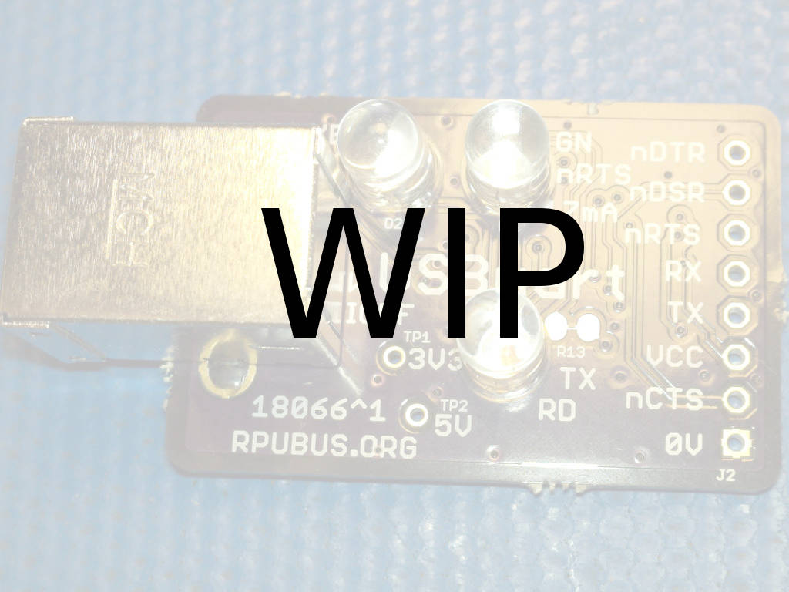

# CCmid Hardware

## Overview

Constant currrent source based on AL8805W5-7 switch mode control for LED or other uses.

## Inputs/Outputs/Functions

```
        350mA setpoint with 0.3 Ohm sense resistor
        Reduce output current with R2 (decreases to 1/5 of set point.)
```


## Uses

```
        LED current source.
        Battery charging from a DC [hiccup mode] supply 
```


# Table Of Contents

1. [Status](#status)
2. [Design](#design)
3. [Bill of Materials](#bill-of-materials)
4. [How To Use](#how-to-use)


# Status

[Options](#bill-of-materials)


```
        ^0  Done: Design (#=done), Layout, BOM,
            WIP: Review*,
            Todo: Order Boards, Assembly, Testing, Evaluation.
            *during review the Design may change without changing the revision.
            # Switch mode CC supply with sense resistor set at 350mA setpoint.
            # Need a TVS to deal with the load dump when the alternat input cuts off power, e.g., SMAJ28A-13-F 
            # Buck cntl IC AL8805W5-7 (like on the Lux board)
```

Debugging and fixing problems i.e. [Schooling](./Schooling/)

Setup and methods used for [Evaluation](./Evaluation/)


# Design

The board is 0.063 thick, FR4, two layer, 1 oz copper with ENIG (gold) finish.





## Electrical Schematic


## Testing

Check correct assembly and function with [Testing](./Testing/)


# Bill of Materials

The BOM is a CVS file(s), import it into a spreadsheet program like LibreOffice Calc (or Excel), or use a text editor.

Option | BOM's included
----- | ----- 
A. | [BRD] 
M. | [BRD] [SMD] [HDR] 

[BRD]: ./Design/20224BRD,BOM.csv
[SMD]: ./Design/20224SMD,BOM.csv
[HDR]: ./Design/20224HDR,BOM.csv

[Available](https://rpubus.org/Order_Form.html)


# How To Use

The datasheet shows an I[CTRL] vs V[CTRL] plot that idicates sinking some current from the I[CTRL] pin will reduce its voltage. Sinking more than 50 uA will turn it off. I have shown a 3.74k Ohm on the schmatic, which seems to reduce the ouput current to less than 50% of the setpoint on a few samples but this varies significanly withe each lot.


