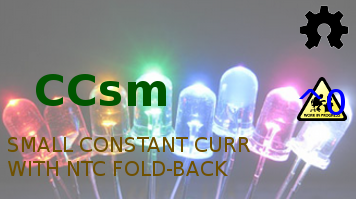
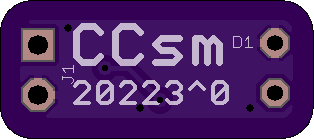
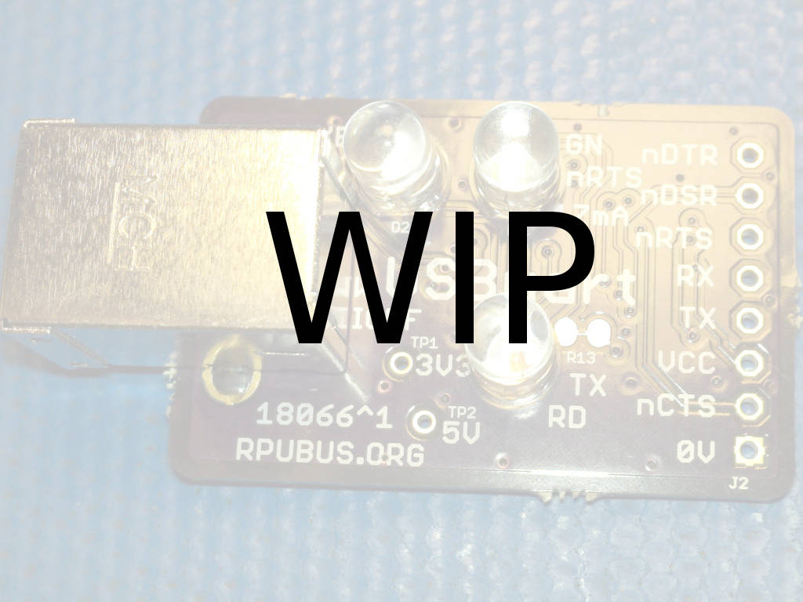
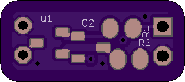
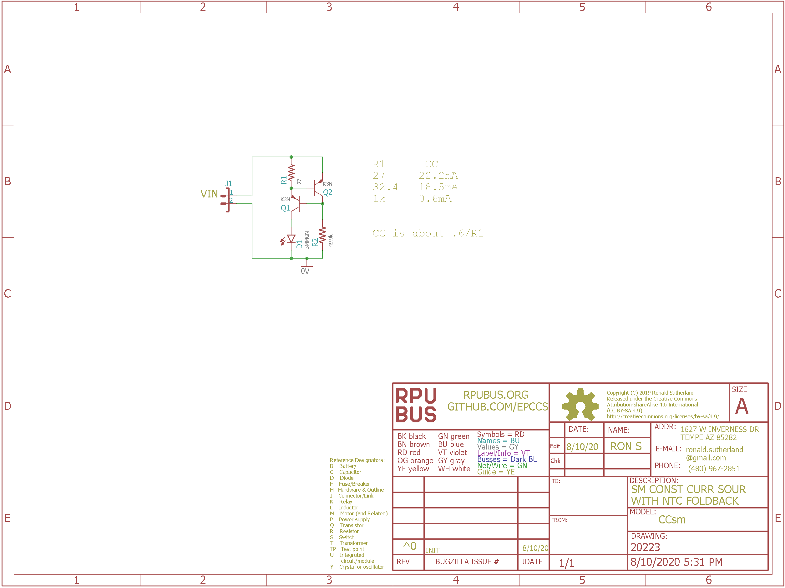

# CCsm Hardware

## Overview

Small constant current source for LED and other uses. Negative temperature coefficient (NTC) reduces current (thermal fold-back) with increasing temperature (about 0.2 %/K)

## Inputs/Outputs/Functions

```
        22mA with 27 Ohm sense resistor
        Thermal fold-back allows operation with 24V input (warning it will burn if touched).
```


## Uses

```
        LED current source.
        Limit the arc energy in a switch or contact.
        Non-destructive circuit testing (may need to adjust the setpoint.)
```


# Table Of Contents

1. [Status](#status)
2. [Design](#design)
3. [Bill of Materials](#bill-of-materials)
4. [How To Use](#how-to-use)


# Status

[Options](#bill-of-materials)



```
        ^0  Done: Design, Layout (#=done),
            WIP: BOM,
            Todo: Review*, Order Boards, Assembly, Testing, Evaluation.
            *during review the Design may change without changing the revision.
```

Debugging and fixing problems i.e. [Schooling](./Schooling/)

Setup and methods used for [Evaluation](./Evaluation/)


# Design

The board is 0.063 thick, FR4, two layer, 1 oz copper with ENIG (gold) finish.






## Electrical Schematic



## Testing

Check correct assembly and function with [Testing](./Testing/)


# Bill of Materials

The BOM is a CVS file(s), import it into a spreadsheet program like LibreOffice Calc (or Excel), or use a text editor.

Option | BOM's included
----- | ----- 
A. | [BRD] 
M. | [BRD] [SMD] [HDR] 

[BRD]: ./Design/20223BRD,BOM.csv
[SMD]: ./Design/20223SMD,BOM.csv
[HDR]: ./Design/20223HDR,BOM.csv

[Available](https://rpubus.org/Order_Form.html)


# How To Use

TBD


