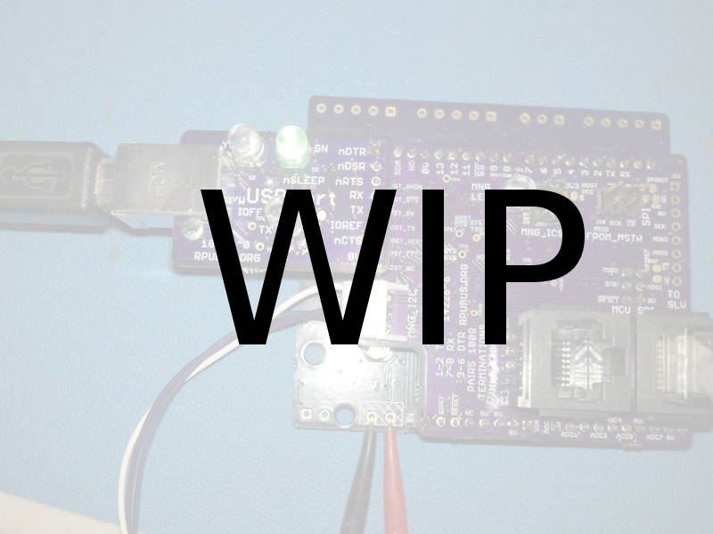

# Description

This is a list of Test preformed on each board after assembly.

# Table of References


# Table Of Contents:

1. Basics
2. Assembly check
3. IC Solder Test
4. Bias 


## Basics

These tests are for an assembled CCsm board 20223^0 which may be referred to as a Unit Under Test (UUT). If the UUT fails and can be reworked then do so, otherwise it needs to be scraped. 

__Warning__: never use a soldering iron to rework ceramic capacitors due to the thermal shock.

Items used for test.



## Assembly check

After assembly check the circuit carefully to make sure all parts are soldered and correct. The device marking is labeled on the schematic and assembly drawing.


## IC Solder Test

Check that a diode drop to 0V is present from a circuit board pad that is connected to each of the pins of the IC's. Measure with a DMM's diode test. Consult the schematic to determine which pins can be skipped (e.g. ground, power rail, ...).


## Bias

Setup a current limited supply with 12V and about 30mA limit. Short the LED output. Connect the supply to the input. Measure the input current.

``` 
{ "CC_SM_CURR_mA":[TBD,] }
``` 
