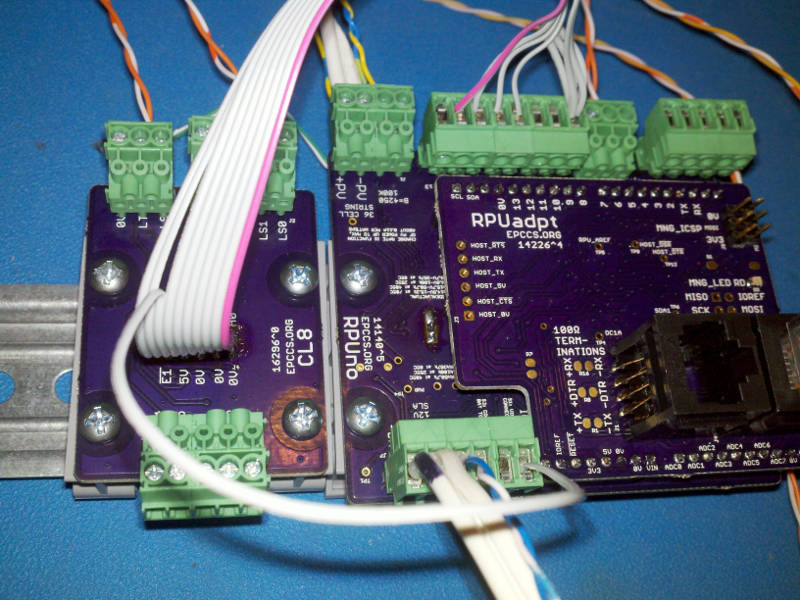

# Description

This shows the setup and methods used for evaluation of CL8.

# Table of References

# Table Of Contents:

1. ^0 Bench Test with RPUno^5 RPUadpt^4 and HT^1

## ^0 Bench Test with RPUno^5 RPUadpt^4 and HT^1

Seems to work on the Bench.

