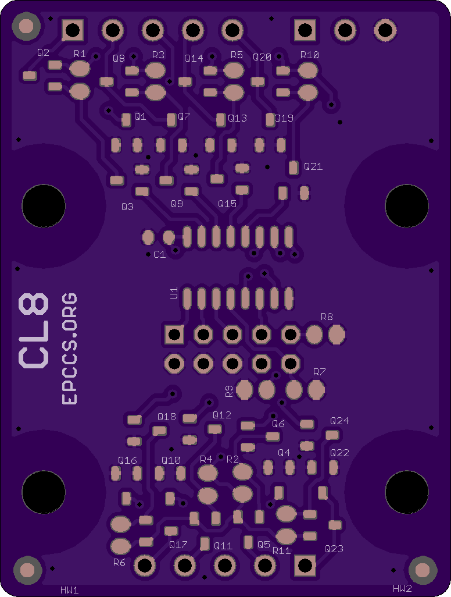
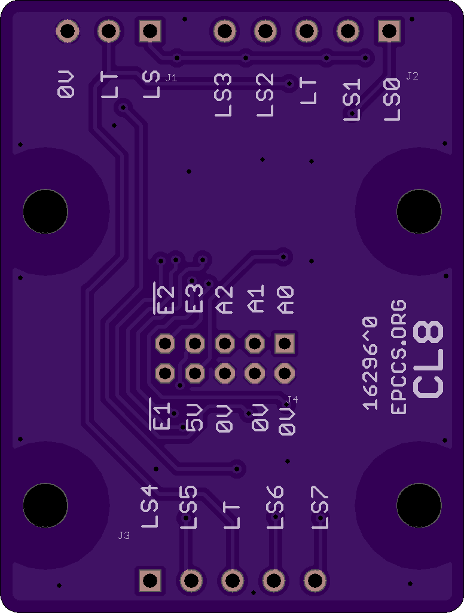
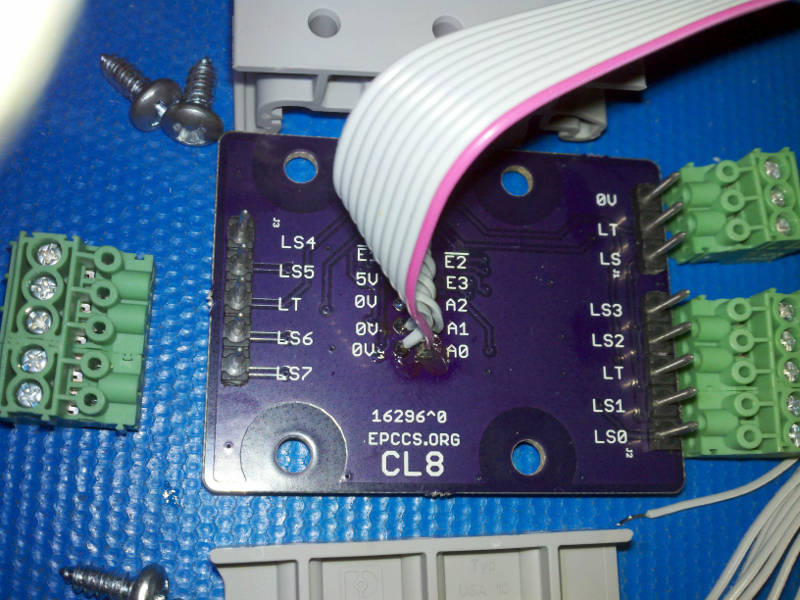
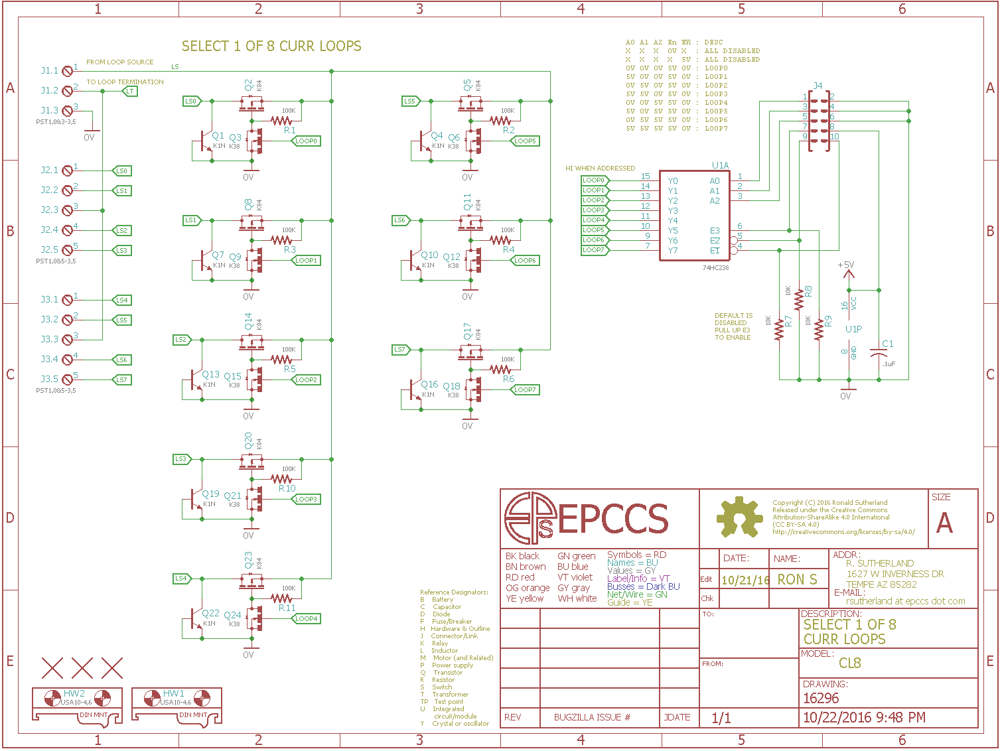

# CL8 Hardware

## Overview

Select 1 of 8 Current Loop sensors. The sellected current  path returns current flow to a common termination (sense) resistor.

## Inputs/Outputs/Functions

```
        Input a current loop source
        Output to a loop termination resistor
        Ditital control using a 74HC238 logic IC
        Multiplex 1 of 8 sensors with a supply (current source).
```


## Uses

```
        Select one from several sensors (e.g. MT, LT, HT).
```


# Table Of Contents

1. [Status](#status)
2. [Design](#design)
3. [Bill of Materials](#bill-of-materials)
4. [How To Use](#how-to-use)


# Status


This was split out of Irrigate7 to try some ideas. The plan was to use this with the input capture (ICP3) on Irrigate7 to measure pulse timing from soil moisture sensors. However CL8 also works with regular current loops on the ADC inputs and can be used with RPUno. Irrigate7 with two pulse sensor inputs seems like a good idea, so this circuit will not be integrated back onto that board but can be used with it. 

```
        ^0  Done: Design, Layout, BOM, Review*, Order Boards, Assembly, 
            WIP: Testing (sort of on hold for now), 
            Todo: Evaluation.
            *during review the Design may change without changing the revision.
            location: 2016-11-12 Bench.
```

Debugging and fixing problems i.e. [Schooling](./Schooling/)

Setup and methods used for [Evaluation](./Evaluation/)


# Design

The board is 0.063 thick, FR4, two layer, 1 oz copper with ENIG (gold) finish.






## Electrical Parameters (Typical)

```
input SUPPLY guidance: 4V to 7V
TBD (it is OSH)
```

## Mounting

```
        DIN rail
```

## Electrical Schematic



## Testing

Check correct assembly and function with [Testing](./Testing/)


# Bill of Materials

Import the [BOM](./Design/16296,BOM.csv) into LibreOffice Calc (or Excel) with semicolon separated values, or use a text editor.


# How To Use

For this circuit, the idea is to set one of the E3, nE2, or nE3 to DISABLE. Then change A0, A1, A2. Once A0 ... A2 have been selected the action happens when E3, nE2, and nE3 are all set active. Use the following settings:  

```
         A0 A1 A2 E3 nE2 nE1 : DESC
         X  X  X  0V X   X   : ALL DISABLED
         X  X  X  X  5V  X   : ALL DISABLED
         X  X  X  X  X   5V  : ALL DISABLED
         0V 0V 0V 5V 0V  0V  : LS0 SELECTED
         5V 0V 0V 5V 0V  0V  : LS1 SELECTED
         0V 5V 0V 5V 0V  0V  : LS2 SELECTED
         5V 5V 0V 5V 0V  0V  : LS3 SELECTED
         0V 0V 5V 5V 0V  0V  : LS4 SELECTED
         5V 0V 5V 5V 0V  0V  : LS5 SELECTED
         0V 5V 5V 5V 0V  0V  : LS6 SELECTED
         5V 5V 5V 5V 0V  0V  : LS7 SELECTED
```

I have some capacitive sensors (MT, LT and HT) that operate a pulsed current loop by transmiting a 3mA or 10mA signal depending on the output of a 555 type timer. The signal is converted into a voltage pulse by the loops sense resistor that dubles as a transmission line termination resistor. This board is used to direct power (on RPUno use the 17mA pin of the FT/PULSE connector) to one of the sensors and then return the selected sensors transmitted signal on a common circuit node (LT) that should be connected to the termination resistor (on RPUno use the PL pin of the FT/PULSE connector).


