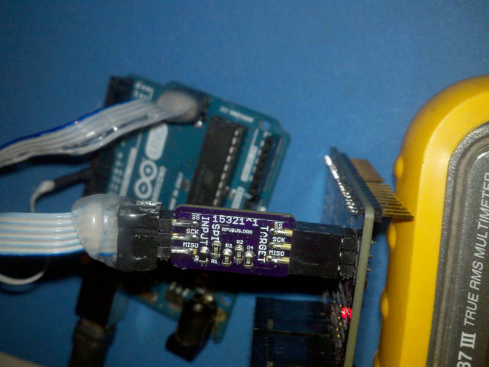
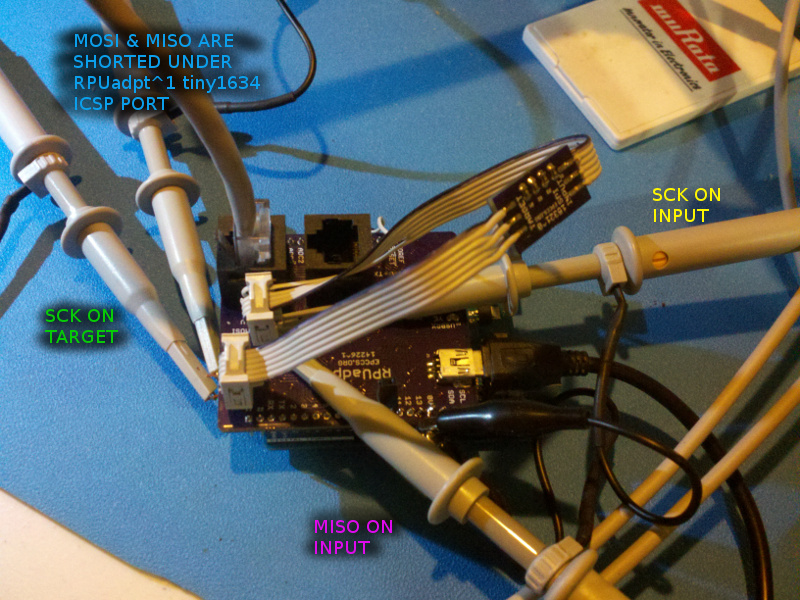

# Description

This shows the setup and methods used for evaluation of ICSP.

# Table of References

# Table Of Contents:

2. ^1 Programing RPUadpt
1. ^0 SPI loopback Test

## ^1 Programing RPUadpt

An Arduino Uno with the [ArduinoISP] example sketch is used to load an [RPUadpt] ^5 with firmware.

[ArduinoISP]: https://github.com/arduino/Arduino/blob/master/build/shared/examples/11.ArduinoISP/ArduinoISP/ArduinoISP.ino
[RPUadpt]: https://github.com/epccs/RPUadpt

## ^0 SPI loopback Test

Setup an RPUadpt^1 board to Loopback the SPI data from a 3.3V target. Note RPUadpt^1 had an ATtiny1634 which was changed to an ATmega328p.

Looked at the SCK and MOSI/MISO on TARGET side and INPUT side.

