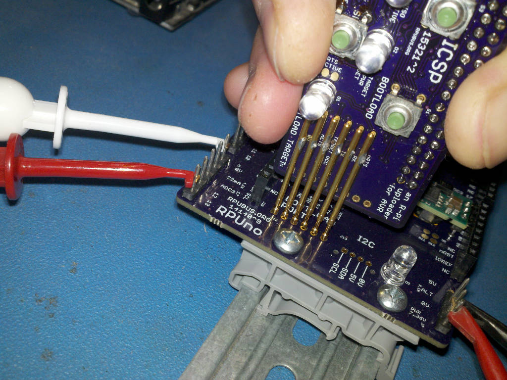

# Description

This shows the setup and methods used for evaluation of ICSP.

# Table of References


# Table Of Contents:

1. ^2 ICSP over SPI with Pi Zero W
1. ^2 Serial Port with Pi Zero W
1. ^1 Programing RPUadpt
1. ^0 SPI loopback Test


## ^2 ICSP over SPI with Pi Zero W

Lets do a loopback test for SPI, so short MISO to MOSI and power VCC with 5V.

``` 
sudo usermod -a -G spi rsutherland
mkdir spiLoopBack
cd spiLoopBack
wget https://raw.githubusercontent.com/epccs/RPUno/master/SpiSlv/spidev_test.c
gcc -o spidev_test spidev_test.c
./spidev_test -s 1000 -D /dev/spidev0.0
./spidev_test -s 10000 -D /dev/spidev0.0
./spidev_test -s 100000 -D /dev/spidev0.0
./spidev_test -s 250000 -D /dev/spidev0.0
./spidev_test -s 500000 -D /dev/spidev0.0
./spidev_test -s 1000000 -D /dev/spidev0.0
./spidev_test -s 2000000 -D /dev/spidev0.0
``` 

The test output

```
spi mode: 0
bits per word: 8
max speed: 500000 Hz (500 KHz)

00 00 00 00 00 00
00 00 00 00 00 00
00 00 00 00 00 00
00 00 00 00 00 00
00 00 00 00 00 00
00 00 00 00 00 00
00 00
``` 

Those should not be zeros. I connected the R-Pi to node MIS0 (note the zero) and the buffer to MISO, this will be indicated in schooling. After some rework it is passing the loopback test.

``` 
spi mode: 0
bits per word: 8
max speed: 500000 Hz (500 KHz)

FF FF FF FF FF FF
40 00 00 00 00 95
FF FF FF FF FF FF
FF FF FF FF FF FF
FF FF FF FF FF FF
DE AD BE EF BA AD
F0 0D
``` 

Next I have added a linuxspi rule in the RPUpi Remote application's Makefile. I used sudo because of an issue with permissions (see schooling).

``` 
linuxspi:
	sudo avrdude -v -p $(MCU) -C +$(LIBDIR)/avrdude/328pb.conf -c linuxspi -P /dev/spidev0.0 -e -U flash:w:$(TARGET).hex -U lock:w:0xef:m
```

Ran this icsp.py script on the working folder with that Makefile.

https://github.com/epccs/Driver/tree/master/ICSP/Icsp

```
python ~/bin/icsp.py
rsutherland dialout gpio spi
rsutherland dialout gpio spi
sudo avrdude -v -p atmega328pb -C +../lib/avrdude/328pb.conf -c linuxspi -P /dev/spidev0.0 -e -U flash:w:Remote.hex -U lock:w:0xef:m

avrdude: Version 6.3-20171130
         Copyright (c) 2000-2005 Brian Dean, http://www.bdmicro.com/
         Copyright (c) 2007-2014 Joerg Wunsch

         System wide configuration file is "/etc/avrdude.conf"
         User configuration file is "/root/.avrduderc"
         User configuration file does not exist or is not a regular file, skipping
         Additional configuration file is "../lib/avrdude/328pb.conf"
avrdude: warning at ../lib/avrdude/328pb.conf:4: part m328pb overwrites previous definition /etc/avrdude.conf:8573.

         Using Port                    : /dev/spidev0.0
         Using Programmer              : linuxspi
         AVR Part                      : ATmega328PB
         Chip Erase delay              : 9000 us
         PAGEL                         : PD7
         BS2                           : PC2
         RESET disposition             : dedicated
         RETRY pulse                   : SCK
         serial program mode           : yes
         parallel program mode         : yes
         Timeout                       : 200
         StabDelay                     : 100
         CmdexeDelay                   : 25
         SyncLoops                     : 32
         ByteDelay                     : 0
         PollIndex                     : 3
         PollValue                     : 0x53
         Memory Detail                 :

                                  Block Poll               Page                       Polled
           Memory Type Mode Delay Size  Indx Paged  Size   Size #Pages MinW  MaxW   ReadBack
           ----------- ---- ----- ----- ---- ------ ------ ---- ------ ----- ----- ---------
           eeprom        65    20     4    0 no       1024    4      0  3600  3600 0xff 0xff
           flash         65     6   128    0 yes     32768  128    256  4500  4500 0xff 0xff
           lfuse          0     0     0    0 no          1    0      0  4500  4500 0x00 0x00
           hfuse          0     0     0    0 no          1    0      0  4500  4500 0x00 0x00
           lock           0     0     0    0 no          1    0      0  4500  4500 0x00 0x00
           calibration    0     0     0    0 no          1    0      0     0     0 0x00 0x00
           signature      0     0     0    0 no          3    0      0     0     0 0x00 0x00
           efuse          0     0     0    0 no          1    0      0  4500  4500 0x00 0x00

         Programmer Type : linuxspi
         Description     : Use Linux SPI device in /dev/spidev*

avrdude: AVR device initialized and ready to accept instructions

Reading | ################################################## | 100% 0.00s

avrdude: Device signature = 0x1e9516 (probably m328pb)
avrdude: safemode: lfuse reads as FF
avrdude: safemode: hfuse reads as D6
avrdude: safemode: efuse reads as FD
avrdude: erasing chip
avrdude: reading input file "Remote.hex"
avrdude: input file Remote.hex auto detected as Intel Hex
avrdude: writing flash (5792 bytes):

Writing | ################################################## | 100% 1.60s

avrdude: 5792 bytes of flash written
avrdude: verifying flash memory against Remote.hex:
avrdude: load data flash data from input file Remote.hex:
avrdude: input file Remote.hex auto detected as Intel Hex
avrdude: input file Remote.hex contains 5792 bytes
avrdude: reading on-chip flash data:

Reading | ################################################## | 100% 1.34s

avrdude: verifying ...
avrdude: 5792 bytes of flash verified
avrdude: reading input file "0xef"
avrdude: writing lock (1 bytes):

Writing | ################################################## | 100% 0.01s

avrdude: 1 bytes of lock written
avrdude: verifying lock memory against 0xef:
avrdude: load data lock data from input file 0xef:
avrdude: input file 0xef contains 1 bytes
avrdude: reading on-chip lock data:

Reading | ################################################## | 100% 0.00s

avrdude: verifying ...
avrdude: 1 bytes of lock verified

avrdude: safemode: lfuse reads as FF
avrdude: safemode: hfuse reads as D6
avrdude: safemode: efuse reads as FD
avrdude: safemode: Fuses OK (E:FD, H:D6, L:FF)

avrdude done.  Thank you.

icsp_pin falling event occured so use_bootload_pin_to_stop flag cleared
press icsp_pin again to end program
```

That was fast, that was the fastest I have seen anything go.


## ^2 Serial Port with Pi Zero W

```
Linux icsp1 4.14.98+ #1200 Tue Feb 12 20:11:02 GMT 2019 armv6l
```

RTS and CTS handshake is only valid with uart0, so I need to use the Alt0 pin functions. Unfortunately, raspi-config cannot change the config file at this time.

```
sudo systemctl list-units hciuart
sudo systemctl disable hciuart
sudo nano /boot/config.txt 
```

```
dtoverlay=pi3-disable-bt
# Alt0 pin function
dtoverlay=uart0,pin_func=4
# raspi-config can set enable_uart
enable_uart=1
```

As the R-Pi Zero W boots up the D1 green LED is dimly lit. Once the overlay is applied D1 turns off, the R-Pi pin has 1.6V at power on and does sink some current. It is acceptable for this application, but that is not how the AVR's or PIC's that I have used power up. 

I did a script so that I can push the bootload button (S1) and run the make bootload rule. I run that script after setting the working folder to the location with the make rule (e.g., change directory to the folder with Makefile).

https://github.com/epccs/Driver/tree/master/ICSP/Bootload



I am impressed with how easy it was to automate these builds; the toil of tracking hex files was what I was expecting based on experience, but going from the source in the repository to binary upload with the tool alone is satisfying.


## ^1 Programing RPUadpt

An Arduino Uno with the [ArduinoISP] example sketch is used to load an [RPUadpt] ^5 with firmware.

[ArduinoISP]: https://github.com/arduino/Arduino/blob/master/build/shared/examples/11.ArduinoISP/ArduinoISP/ArduinoISP.ino
[RPUadpt]: https://github.com/epccs/RPUadpt


## ^0 SPI loopback Test

Setup an RPUadpt^1 board to Loopback the SPI data from a 3.3V target. Note RPUadpt^1 had an ATtiny1634 which was changed to an ATmega328p.


Looked at the SCK and MOSI/MISO on TARGET side and INPUT side.

