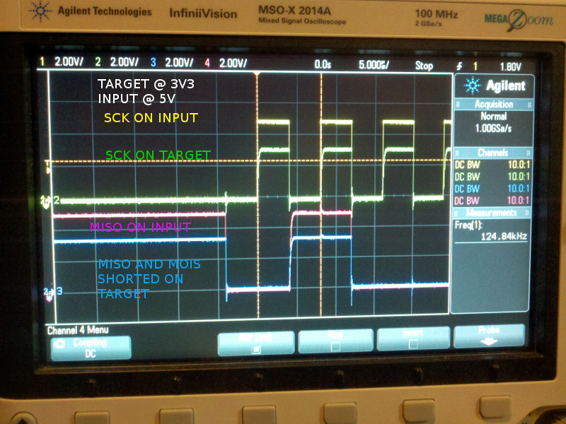

# Description

This shows the setup and methods used for evaluation of ICSP.

# Table of References


# Table Of Contents:

1. ^2 Serial Port with Pi Zero W
1. ^1 Programing RPUadpt
1. ^0 SPI loopback Test


## ^2 Serial Port with Pi Zero W

```
Linux icsp1 4.14.98+ #1200 Tue Feb 12 20:11:02 GMT 2019 armv6l
```

RTS and CTS handshake is only valid with uart0, so I need to use the Alt0 pin functions. Unfortunately, raspi-config cannot change the config file at this time.

```
sudo systemctl list-units hciuart
sudo systemctl disable hciuart
sudo nano /boot/config.txt 
```

```
dtoverlay=pi3-disable-bt
# Alt0 pin function
dtoverlay=uart0,pin_func=4
# raspi-config can set enable_uart
enable_uart=1
```

As the R-Pi Zero W boots up the D1 green LED is dimly lit. Once the overlay is applied D1 turns off, the R-Pi pin has 1.6V at power on and does sink some current. It is acceptable for this application, but that is not how the AVR's or PIC's that I have used power up. 

Todo. bootload a board with push button.


## ^1 Programing RPUadpt

An Arduino Uno with the [ArduinoISP] example sketch is used to load an [RPUadpt] ^5 with firmware.

[ArduinoISP]: https://github.com/arduino/Arduino/blob/master/build/shared/examples/11.ArduinoISP/ArduinoISP/ArduinoISP.ino
[RPUadpt]: https://github.com/epccs/RPUadpt


## ^0 SPI loopback Test

Setup an RPUadpt^1 board to Loopback the SPI data from a 3.3V target. Note RPUadpt^1 had an ATtiny1634 which was changed to an ATmega328p.


Looked at the SCK and MOSI/MISO on TARGET side and INPUT side.

