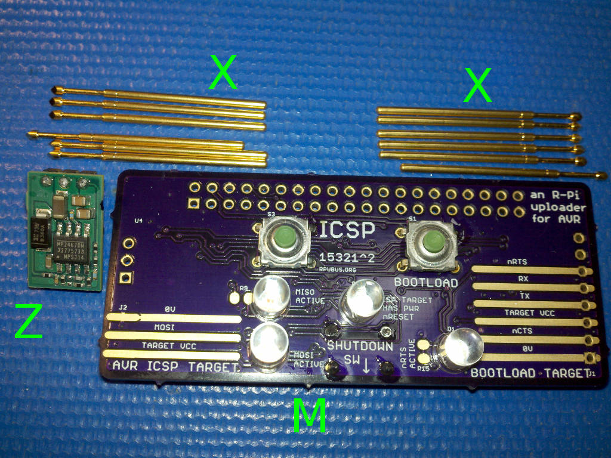

# ICSP Hardware

## Overview

Use a Raspberry Pi Zero as a host to do In-Circuit Serial Programming of AVR’s. IOFF buffers are used to level convert to the targets voltage. It also allows the serial port to be used for serial bootload and has some switches to control looping of the upload. 


## Inputs/Outputs/Functions

```
        Open Drain Voltage level converter for ICSP pins 
        Open Drain Voltage level converter for serial bootload pins
        Swithchs for control of Shutdown, Bootload, and ICSP.
```


## Uses

```
        In-Circuit Serial Programing of AVR target 2V7 to 5V. 
        Bootload programing of target (1.8V to 5V).
        Use your own R-Pi software to detect a switch (BCM13, BCM5) and run the uploader.
```


# Table Of Contents

1. [Status](#status)
2. [Design](#design)
3. [Bill of Materials](#bill-of-materials)
4. [How To Use](#how-to-use)


# Status

[Options](#bill-of-materials)


```
        ^2  Done: Design, Layout, BOM, Review*, Order Boards, Assembly,
            WIP: Testing,
            Todo: Evaluation.
            *during review the Design may change without changing the revision.
            try with an R-Pi zero rather than Uno with ISP sketch.
            set up the serial port for bootloading use.
            set up better for pogo pins.

        ^1  Done: Design, Layout, BOM, Review*, Order Boards, Assembly, Testing,
            WIP: Evaluation.
            Todo:  
            *during review the Design may change without changing the revision.
            fixed the pads so the connector/header works.

        ^0  Done: Design, Layout, BOM, Review*, Order Boards, Assembly, Testing, Evaluation.
            location: 2015-12-15 Bench /w ArduinoISP sketch on an Uno 
            location: 2015-12-25 Shelf /w ArduinoISP sketch on an Uno 
```

Debugging and fixing problems i.e. [Schooling](./Schooling/)

Setup and methods used for [Evaluation](./Evaluation/)


# Design

The board is 0.063 thick, FR4, two layer, 1 oz copper with ENIG (gold) finish.





## Electrical Parameters (Typical)

```
74LVCO7A input are tolerant to 5.5V
74LVCO7A supply on target side can range from 1.65V to 5.5V
When used for in-circuit programming consult the MCU datasheet for valid programming voltages (AVR seems to mostly be 2V7 to 5V).
```

## Mounting

```
        Connectors or pogo pins are to be soldered by user
```

## Electrical Schematic


## Testing

Check correct assembly and function with [Testing](./Testing/)


# Bill of Materials

The BOM is a CVS file(s), import it into a spreadsheet program like LibreOffice Calc (or Excel), or use a text editor.

Option | BOM's included
----- | ----- 
A. | [BRD] 
M. | [BRD] [SMD] [HDR] 
X. | [BRD] [SMD] [HDR] [POGO]
Z. | [BRD] [SMD] [HDR] [POGO] [POL]

[BRD]: ./Design/15321BRD,BOM.csv
[SMD]: ./Design/15321SMD,BOM.csv
[HDR]: ./Design/15321HDR,BOM.csv
[POGO]: ./Design/15321POGO,BOM.csv
[POL]: ./Design/15321POL,BOM.csv

[Available](https://rpubus.org/Order_Form.html)

# How To Use

This tool works with Makefiles and its rules. For example, I do a “git pull” then “make isp” or "make bootload" to load my project firmware, and this adds a little Python program to operate those rules when a button is pushed.

The option exists to use connectors or pogo pins (e.g. [ICT-100-T]). I am not yet sure of a pleasant way to solder the pogo pins without some pain, they are also expensive, but the advantage of not having to solder headers on my various boards is worth it to me.

[ICT-100-T]: http://www.mouser.com/Search/Refine.aspx?Keyword=ICT-100-T

The 74LVC07A has IOFF circuitry which disables the output to prevent damaging current backflow when the device is powered down since the buffer is powered by the target removing power from the target device after programming is both safe and advised.


## Bootload

The R-Pi host can use its hardware serial to upload firmware to a serial bootloader with a verity of methods: optiboot is "avrdude -c arduino," xboot is "avrdude -c avr109". It can also operate serial tools like an Uno loaded with [ArduinoISP] "avrdude -c stk500v1", [ElTangas/STK2UPDI] with "avrdude -c stk500v2", or even [mraardvark/pyupdi]. The pinout is like an [FTDI_Friend].

[ArduinoISP]: https://github.com/arduino/Arduino/blob/master/build/shared/examples/11.ArduinoISP/ArduinoISP/ArduinoISP.ino
[ElTangas/STK2UPDI]: https://github.com/ElTangas/STK2UPDI
[mraardvark/pyupdi]: https://github.com/mraardvark/pyupdi/
[FTDI_Friend]: https://www.adafruit.com/product/284

Run the [bootld.py] script over an SSH connection in a folder with the Makefile bootload rule. 

[bootld.py]: ./Bootload


## ICSP on SPI

The R-Pi host can also upload with "avrdude -c linuxspi" or bit-bang with "avrdude -c linuxgpio." 

Run the [icsp.py] script over an SSH connection in a folder with the Makefile isp rule. 

[icsp.py]: ./Iscp


