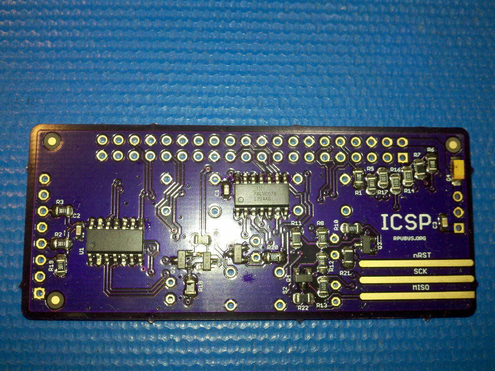

# ICSP Hardware

## Overview

Voltage level translation for SPI with IOFF.

## Inputs/Outputs/Functions

```
        Voltage level converter for SPI
```


## Uses

```
        In-Circuit Serial Programing 3.3V target from a 5V Uno
```


# Table Of Contents

1. [Status](#status)
2. [Design](#design)
3. [Bill of Materials](#bill-of-materials)
4. [How To Use](#how-to-use)


# Status


```
        ^1  Done: Design, Layout, BOM, Review*, Order Boards, Assembly, Testing,
            WIP: Evaluation.
            Todo:  
            *during review the Design may change without changing the revision.
            fixed the pads so the connector/header works.

        ^0  Done: Design, Layout, BOM, Review*, Order Boards, Assembly, Testing, Evaluation.
            location: 2015-12-15 Bench /w ArduinoISP sketch on an Uno 
            location: 2015-12-25 Shelf /w ArduinoISP sketch on an Uno 
```

Debugging and fixing problems i.e. [Schooling](./Schooling/)

Setup and methods used for [Evaluation](./Evaluation/)


# Design

The board is 0.063 thick, FR4, two layer, 1 oz copper with ENIG (gold) finish.




## Electrical Parameters (Typical)

```
74LVCO7A input are tolerant to 5.5V
74LVCO7A supply on target side can range from 1.65V to 5.5V
When used for in-circuit programming consult the MCU datasheet for valid programming voltages.
```

## Mounting

```
        Connectors or pogo pins are to be soldered by user
```

## Electrical Schematic


## Testing

Check correct assembly and function with [Testing](./Testing/)


# Bill of Materials

Import the [BOM](./Design/15321,BOM.csv) into LibreOffice Calc (or Excel) with semicolon separated values, or use a text editor.


# How To Use

Solder connectors or try some pogo pins (e.g. [ICT-100-T] ), though I fight with the jig to hold them in place.

[ICT-100-T]: http://www.mouser.com/Search/Refine.aspx?Keyword=ICT-100-T

The ArduinoISP sketch in examples that makes an Arduino board into an ICSP tool shows the required wirring connections. I have only used an Uno with this but the other boards should work (even the ones with 3.3V). 

The top speed of SCK is not yet known.

The 74LVC07A has IOFF circuitry which disables the output to prevent damaging current backflow when the device is powered down. It is powered by the target so removing power from the target after programming is safe.


