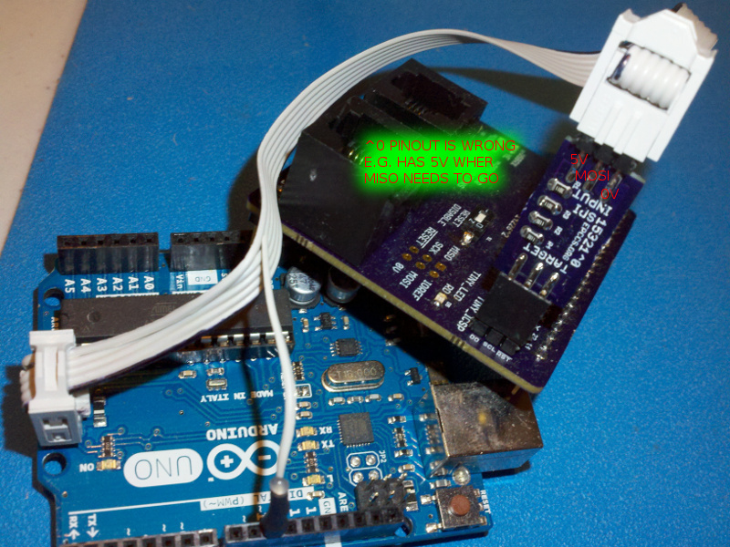

# Description

Some lessons I learned doing ICSP.

# Table Of Contents:

1. ^2 linuxspi gpio op wr fails
1. ^2 spi fails loopback test
1. ^0 Edge Pinout is Wrong


## ^2 linuxspi gpio op wr fails

```
         Using Port                    : /dev/spidev0.0
         Using Programmer              : linuxspi
avrdude: linuxspi_gpio_op_wr(): Unable to open file /sys/class/gpio/gpio25/direction
avrdude done.  Thank you.
```

When running avrdude as non-root the linuxspi driver tries to open the files before the permissions have been changed. The driver changes the direction of the pin but the permissions are done with udev rules and that takes some time. 

https://github.com/kcuzner/avrdude/pull/17/

The version of avrdude in Raspian is 

```
avrdude -v
avrdude: Version 6.3-20171130
```

I think Raspian's avrdude is from facchinm, but it is is older than this update:

https://github.com/facchinm/avrdude/commit/aa0d28f774147fb03f8b18cd065586c7a93a2b0b

So I guess this needs build from source to fix the issue (or I run it with an sudo). 


## ^2 spi fails loopback test

I connected the R-Pi to node MIS0 (note the zero) and the buffer to MISO, so there was no path route.

Rework: run wire from inside pad of R6 to R-Pi pin 21.


## ^0 Edge Pinout is Wrong

This is a layout mistake.




