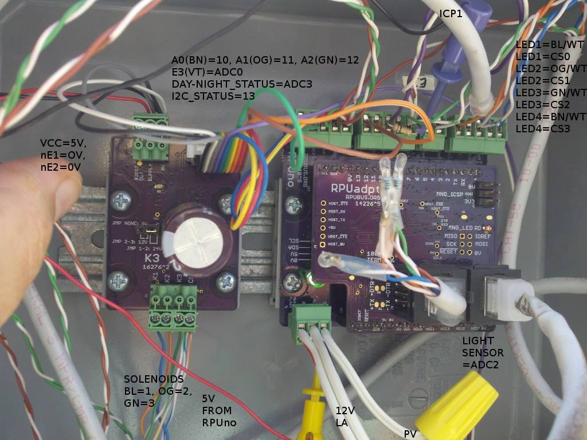
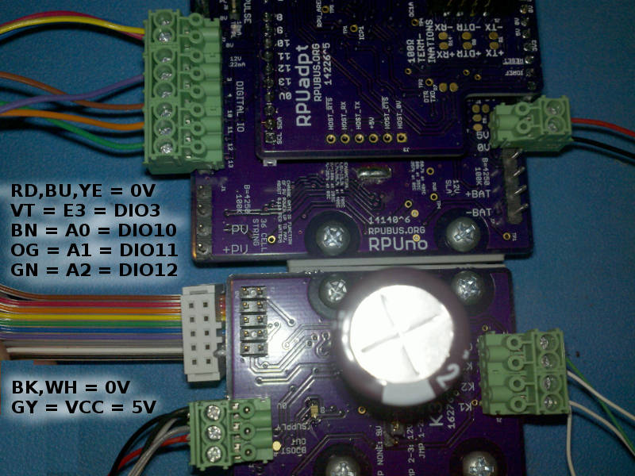
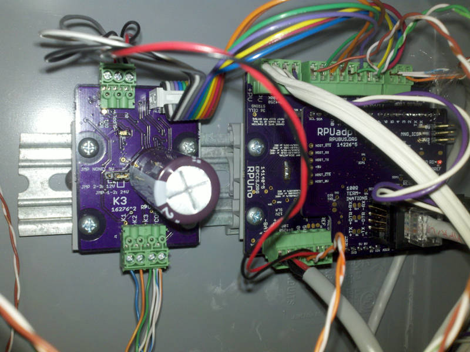

# Description

This shows the setup and methods used for evaluation of K3.

# Table of References

# Table Of Contents:

1. ^2 Replaced RPUno^5 with RPUno^9
1. ^2 Year+ Cycle test with RPUno^5
1. ^2 Cycle test with RPUno^5
1. ^2 Multi Color IDC with RPUno^6
1. ^2 Bench Test with RPUno^6 RPUadpt^5 and RPUftdi^4
1. ^1 Cycle test with RPUno^5
1. ^1 Setup with RPUno^5
1. ^0 Cycle test with RPUno^4
1. ^0 Solenoid Control with RPUno^5

## ^2 Replaced RPUno^5 with RPUno^9

The SXSW enclosure has been running for over a year, but RPUno^9 is ready. There are wiring changes and new [KNL] software.  Now there will be some blinking lights at night, perhaps the LED's are silly in the present form. 

[KNL]: https://github.com/epccs/RPUno/tree/master/KNL

## ^2 Year+ Cycle test with RPUno^5

I ran it for over a year with 10 cycles per valve per day, problems are noted in the log file [K3^2log+RPUno^9]. 

[K3^2log+RPUno^9]: ./K3^2+RPUno^5_log.txt

One thing is clear the Orbit valves do not get stuck when operated like this. I was having a problem where they would get stuck open, most likely that was caused by the hard water mineral build. Perhaps the frequent operation dislodges the buildup before it reaches a critical level. Unfortunately, the valve is no longer on the mainstream market. It received a lot of complaints about sticking (which were true from my experience). Having said that I still like the valve design, it is incredibly fast acting and is clearly durable when used with a frequency beyond what the controller it was sold with did. There are other valve options I will explore when I can.

Every day each of the three valves operated ten times for over a year. When I looked at the data I would cut and past it into the log. That was when I found a number of issues at the time, some were the battery, some were damaged/broken/separated drip lines and the pressure regulators. Basically, the flow count tells me that I need to look for an issue.  Zone 3 is going wild, but the emitters seem to be working and nothing I have found has failed, so I think the pressure regulator on it is having problems (it has not failed yet so let's see what happens).

## ^2 Cycle test with RPUno^5

I let an RPUno^5 (with mod to measure RAW_PV input) operate three Orbit 58874N valves from 4/18/2017 to 4/30/2017. The three valves were operated ten times each day. The setup is running drip zones for my garden. Some days the [K3^3log] does not have data for various reasons.

[K3^2log]: ./K3^2log.txt

## ^2 Multi Color IDC with RPUno^6

Perhaps the colors can help get the wiring correct in the enclosure.

Placed in an enclosure

## ^2 Bench Test with RPUno^6 RPUadpt^5 and RPUftdi^4

Seems to work on the Bench.

A quick video shows picocom used to do a remote reset. After a reset or power up the [Solenoid] firmware cycles through each latching coil to place them in a known state.

[K3 Rev ^2 Bench Video](http://rpubus.org/Video/RPUno%5E6_RPUadpt%5E5_RPUftdi%5E4_K3%5E2_RemoteReset.mp4 "K3 ^2 Bench Video")

## ^1 Cycle test with RPUno^5

I let an RPUno^5 operate three Orbit 58874N valves from 2/5/2017 to 3/29/2017. Most days the three valves were operated ten times each. The runtime got changed a few times as I got drip zones set up for a garden. Some days the [K3^1log] does not have data for various reasons.

[K3^1log]: ./K3^1log.txt

Items of interest: on 3/19/2017 RPUadpt^4 was placed in enclosure, also disconnect the battery thermistor, and removed the LT3652 NTC input pin thermistor.

## ^1 Setup with RPUno^5

## ^0 Cycle test with RPUno^4

I let an RPUno^4 operate three Orbit 58874N valves from 12/17/2016 to 2/4/2017. Most days the three valves were operated ten times each for ten seconds. Some days the [K3^0log] does not have data for various reasons (e.g. mostly I forgot to read it).

[K3^0log]: ./K3^0log.txt

Items of interest: on 1/4/2017 one of the solenoids was found stuck open. The valve did reset when I sent a command, this happens with my Orbit 58874N valves. On 2/4/2017 the last data reading was taken, it turned out I had damaged the charge controller on the RPUno the night before while equalizing the car battery I was using.

## ^0 Solenoid Control with RPUno^5

An interactive Command Line Interface for [Solenoid] control is wired to LED's to see its function. In my [reset all video] each solenoid is cycled twice (opps), but the logic control is working. After connecting the K3 board I fixed the control program so it cycles each solenoid once as seen when [RPUno with K3 video] is seen. 
    
[Solenoid]: https://github.com/epccs/RPUno/tree/master/Solenoid
[reset all video]: http://rpubus.org/Video/14140%5E5_SolenoidResetAllLogic.mp4
[RPUno with K3 video]: http://rpubus.org/Video/14140%5E5WithK3%5E0.mp4

