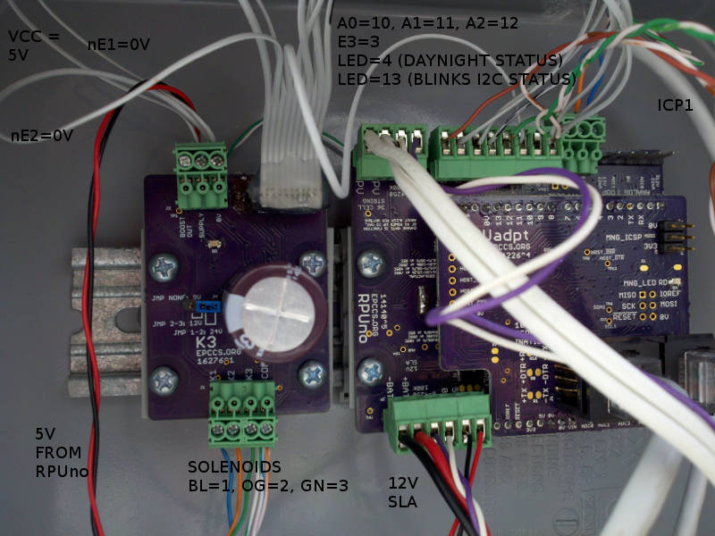
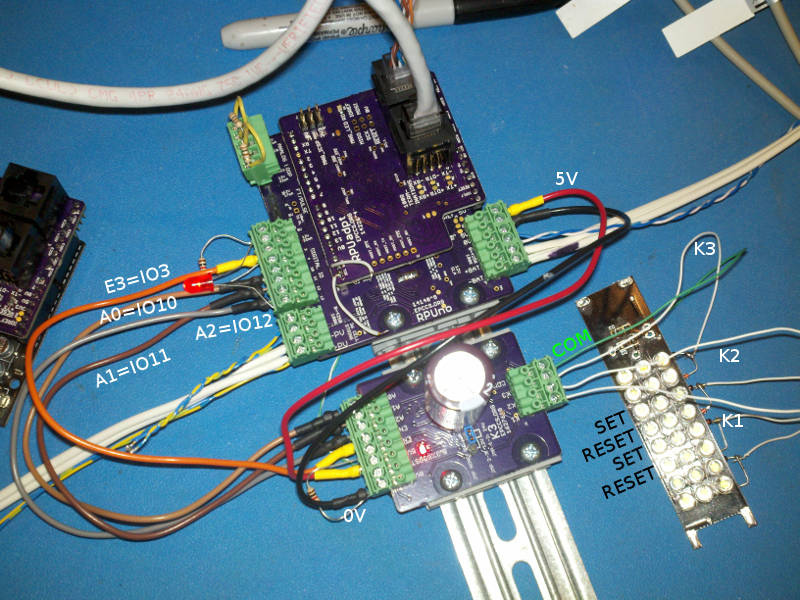

# Description

This shows the setup and methods used for evaluation of K3.

# Table of References

# Table Of Contents:

3. ^1 Setup with RPUno^5
2. ^0 Cycle test with RPUno^4
1. ^0 Solenoid Control with RPUno^5

## ^1 Setup with RPUno^5

## ^0 Cycle test with RPUno^4

I let an RPUno^4 operate three Orbit 58874N valves from 12/17/2016 to 2/4/2017. Most days the three valves were operated ten times each for ten seconds. Some days the [K3^0log] does not have data for various reasons (e.g. mostly I forgot to read it).

[K3^0log]: ./K3^0log.txt

Items of interest: on 1/4/2017 one of the solenoids was found stuck open. The valve did reset when I sent a command, this happens with my Orbit 58874N valves. On 2/4/2017 the last data reading was taken, it turned out I had damaged the charge controller on the RPUno the night before while equalizing the car battery I was using.

## ^0 Solenoid Control with RPUno^5

An interactive Command Line Interface for [Solenoid] control is wired to LED's to see its function. In my [reset all video] each solenoid is cycled twice (opps), but the logic control is working. After connecting the K3 board I fixed the control program so it cycles each solenoid once as seen when [RPUno with K3 video] is seen. 
    
[Solenoid]: https://github.com/epccs/RPUno/tree/master/Solenoid
[reset all video]: http://rpubus.org/Video/14140%5E5_SolenoidResetAllLogic.mp4
[RPUno with K3 video]: http://rpubus.org/Video/14140%5E5WithK3%5E0.mp4

