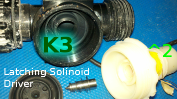
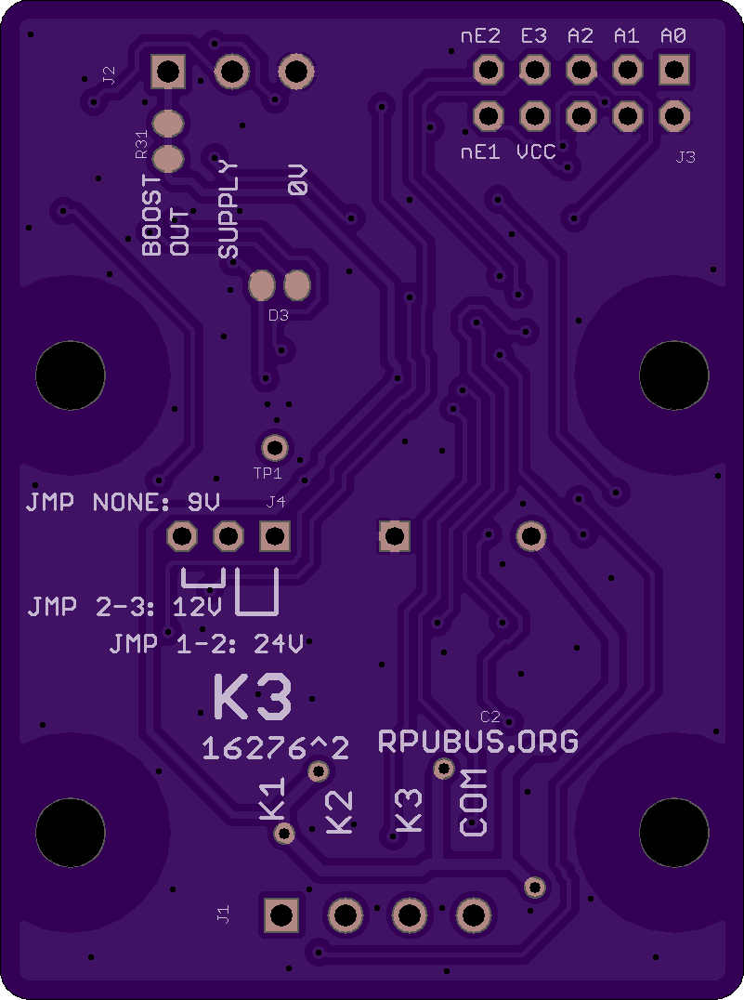

# K3 Latching Solenoid Driver

Three half bridge and a common half bridge that can be used to discharge a (9V/12V/24V) capacitively stored charge into a latching Solenoid coil. A current limited (300mA pk) boost converter can be enabled to build up the storage capacitor from a 5V supply.

## Overview

