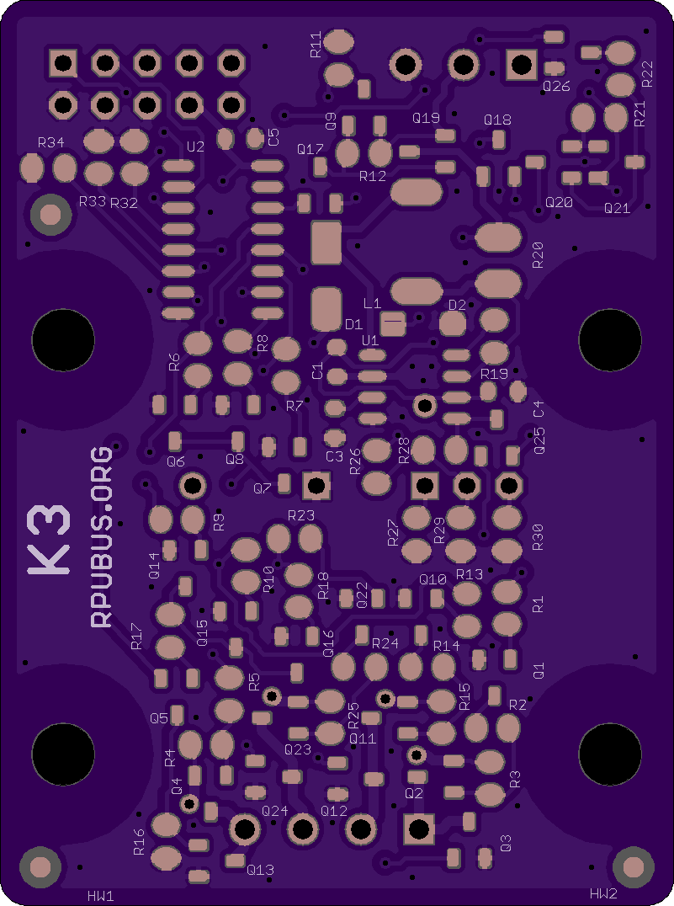
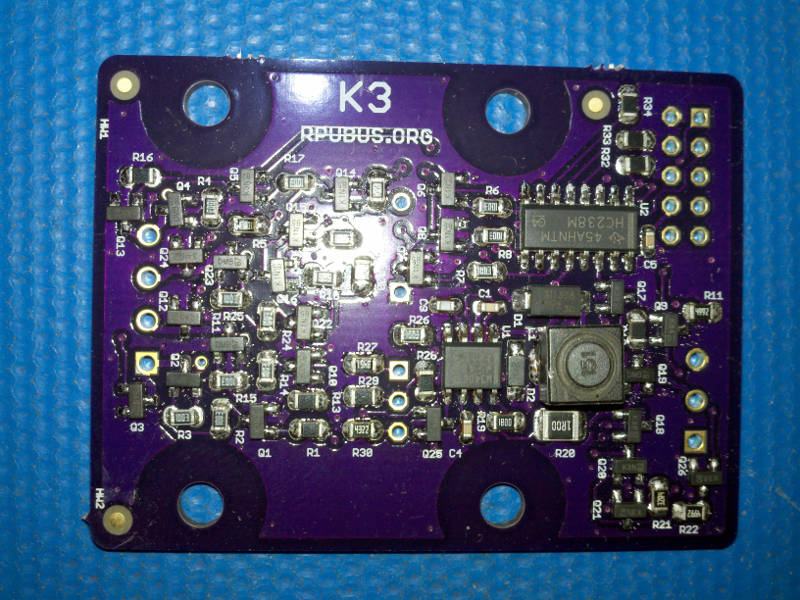
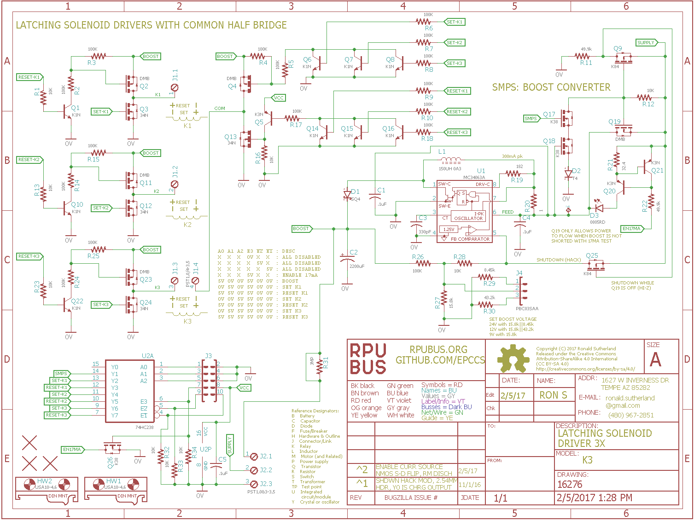

# K3 Hardware

## Overview

This latching solenoid driver board has three half H-bridge and a common half H-bridge that can be used to discharge a (9V/12V/24V) capacitively stored charge into a latching Solenoid coil. A current limited (300mA pk) boost converter (MC34063A) is on board to build up the stored charge from a low voltage (5V) supply.

Latching solenoids are driven with a current pulse that should last a short duration. The pulse from this driver flows in a single coil (don't use with multi-coil solenoids) and establishes a magnetic field that throws the solenoid into either a SET position or a RESET position. The pulse duration hopefully avoids overheating the coils. The Laplace force will not happen unless another magnetic field is present to act on, and will not convert electrical power into mechanical unless the force results in motion. The thrown solenoid also has a back emf in the driving coil.

## Inputs/Outputs/Functions

```
        Boost converter with 300mA pk input current limit.
        Boost leaves 200mA of a USB input for an Uno or ilk.
        Capacitor holds a charge for latching.
```

## Uses

```
        Single Coil Latching solenoids.
        Single Coil Latching relay.
```


# Table Of Contents

1. [Status](#status)
2. [Design](#design)
3. [Bill of Materials](#bill-of-materials)
4. [How To Use](#how-to-use)


# Status

[Options](#bill-of-materials)


```
        ^2  Done: Design, Layout, BOM, Review*, Order Boards, Assembly, Testing,
            WIP: Evaluation.
            Todo:   
            *during review the Design may change without changing the revision.
            Remove the parts that allow boost to connect to plug, just connect it with option to cut jumper.
            Use E3 to enable current source used to test for bridge short (save some power).
            Ship with C2 on pluggable header though I recommend soldering it when the current pulse is much over an Amp.
            location: 2017-3-30 Bench /w RPUno^6, RPUadpt^5.
                      2017-4-17 SxSXWall Encl /w RPUno^5, RPUadpt^4, SLP003-12U, 12V battery.

        ^1  Done: Design, Layout, BOM, Review*, Order Boards, Assembly, Testing, Evaluation.
            location: 2016-2-5 SxSXWall Encl /w RPUno^5, RPUadpt^4, SLP003-12U, 12V battery.
                      2016-4-17 Bench.
            
        ^0  location: 2016-12-1 SWall Encl /w RPUno^4, RPUadpt^4, SLP003-12U, 12V battery.
                      2016-2-4 removed, waiting in scrap bin.
                      2017-3-28 scraped (parts used on ^2).
```

Debugging and fixing problems i.e. [Schooling](./Schooling/)

Setup and methods used for [Evaluation](./Evaluation/)


# Design

The board is 0.063 thick, FR4, two layer, 1 oz copper with ENIG (gold) finish.





## Electrical Parameters (Typical)

```
input SUPPLY guidance: 4V to 7V
TBD (it is OSH)
```

## Mounting

```
        DIN rail
```

## Electrical Schematic



## Testing

Check correct assembly and function with [Testing](./Testing/)


# Bill of Materials

Import the [BOM](./Design/16276,BOM.csv) into LibreOffice Calc (or Excel) with semicolon separated values, or use a text editor.

The BOM is a CVS file(s), import it into a spreadsheet program like LibreOffice Calc (or Excel), or use a text editor.

Option | BOM's included
----- | ----- 
A. | [BRD] 
Z. | [BRD] [SMD] [HDR] [PLUG] [DIN]

[BRD]: ./Design/16276BRD,BOM.csv
[SMD]: ./Design/16276SMD,BOM.csv
[HDR]: ./Design/16276HDR,BOM.csv
[PLUG]: ./Design/16276PLUG,BOM.csv
[DIN]: ./Design/16276DIN,BOM.csv

[Available](https://rpubus.org/Order_Form.html)


# How To Use

First a word about Latching Solenoids and Relays. They latch, so once a SET pulse is sent the physical part stays set until a RESET pulse is sent, even if power is lost. It is normally a good idea to send a reset pulse to each latch after power up to get them into a known state.

Latching Solenoids cost more but they use no power after latched, Energized DC circuits corroded quickly. 

The set pulse applies a voltage to the coil and produces a current in a direction that will cause the Laplace force to move the solenoid into that physical location. The reset pulse applies an opposite polarity to the coil. Once in the location some other force (spring, permanent magnet, air pressure... ), will hold the solenoid in that place.

For this circuit, the idea is to use one of the E3, nE2, or nE3 to DISABLE. Then change A0, A1, A2. Once A0 ... A2 have been selected the action happens when E3, nE2, and nE3 are all set active. Use the following settings:  

```
         A0 A1 A2 E3 nE2 nE1 : DESC
         X  X  X  0V X   X   : ALL DISABLED
         X  X  X  X  5V  X   : ALL DISABLED
         X  X  X  X  X   5V  : ALL DISABLED
         X  X  X  5V X   X   : ENABLE 17mA
         5V 0V 0V 5V 0V  0V  : BOOST
         0V 5V 0V 5V 0V  0V  : SET K1
         5V 5V 0V 5V 0V  0V  : RESET K1
         0V 0V 5V 5V 0V  0V  : SET K2
         5V 0V 5V 5V 0V  0V  : RESET K2
         0V 5V 5V 5V 0V  0V  : SET K3
         5V 5V 5V 5V 0V  0V  : RESET K3
```

Before a pulse can be sent the boost converter has to build a charge. Once E3 is active a 17mA current source will build up some voltage in the storage capacitor. When this is enough (somewhere between 1.2V to 2.2V) to allow the boost converter to turn on it will turn on a PMOS device to let power through and turn on the converter. If a bridge has failed then neither the PMOS or the converter will turn on (but the test current will keep flowing until E3 is disabled). If a charge does build up (as it should) then a pulse can be applied to set/reset one of the solenoids by writing A0, A1, and A2 inputs simultaneously (e.g. a port operation). It is also possible to change one pin at a time with the digitalWrite() function (from Wiring), but care must be taken to have the logic disabled (i.e. E3 = 0V) while selecting the A0/A1/A2 lines otherwise the charge is sent to the first line that changed while making the selection.


I've been using CAT5 pair to wire the coils. At nearly 5 Amps peak that may be risky but for a short duration pulse the CAT5 pair seems to work (your mileage may vary, but it is cheap and the twisted pair helps keep the pulse from generating EMI). 

When the pulse is sent the boost converter is turned off so only the charge in the storage capacitor (2200uF) is sent, this should keep things within the safe operating area of the output MOSFETS as long as at least 4 Ohms of resistance is between the bridges. Anything less than 4 Ohms allows excessive current and will eventually lead to a failure. For reference, 10 meters of CAT5 has less than 1.7 Ohm.

Solenoid options

* Orbit 58874N, 58874Z, 91592, 96120 Latching Solenoid valve (seems to work OK with 24V 50mSec pulse from 2200uF).
* Orbit 57861 Latching Solenoid replacement for AC operated valve (I do not have this, it plugs into Orbits 24V controls but most others are are using 9V).
* DIG S-305DC Solenoid & Adapters (http://www.digcorp.com/professional-irrigation-products/s-305dc-9-vdc-solenoid-adapters).
* Hunter 458200 Latching Solenoid for AC operated valve (e.g. ICV201GDC and ilk, but I do not have one, probably 9V pulse)
* Irritrol DCL Latching Solenoid for AC operated valve (e.g. 2400S and ilk, but I do not have one, probably 9V pulse)


