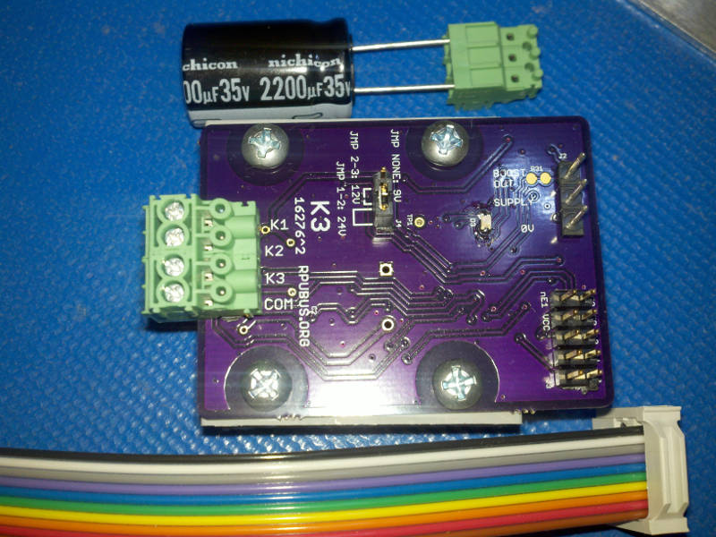

# K3 Hardware

## Overview

This latching solenoid driver board has three half bridge and a common half bridge that can be used to discharge a (9V/12V/24V) capacitively stored charge into a latching Solenoid coil. A current limited (300mA pk) boost converter is on board to build up the storage capacitor from a low voltage (5V) supply.

Latching solenoids are driven with a current pulse that last a short duration. The pulse flows in a coil and establishes a magnetic field which can do work if it results in a Laplace force that throws the solenoid. The pulse duration hopefully avoids overheating the coils. The Laplace force will not happen unless another magnetic field is present to act on, and will not convert electrical power into mechanical unless the force results in motion. The thrown solenoid has a back emf in the driving coil which may be useful to sense if the solenoid got stuck.

## Inputs/Outputs/Functions

```
        Boost converter with 300mA pk input current limit.
        Boost leaves 200mA of a USB input for an Uno or ilk.
        Capacitor holds a charge for latching.
```


## Uses

```
        Latching solenoids.
        Latching relay.
```

# Table Of Contents

1. [Status](#status)
2. [Design](#design)
3. [Bill of Materials](#bill-of-materials)
4. [How To Use](#how-to-use)


# Status


This was split out of Irrigate7 to try some ideas. The goal is to return an improved version to the Irrigate7 board.

```
        ^2  Done: Design, Layout, BOM,
            WIP: Review*,
            Todo:  Order Boards, Assembly, Testing, Evaluation.
            *during review the Design may change without changing the revision.
            Remove the parts that allow boost to connect to plug, just connect it with option to cut jumper.
            Use E3 to enable current source used to test for bridge short (save a power durring night).

        ^1  Done: Design, Layout, BOM, Review*, Order Boards, Assembly, Testing,
            WIP: Evaluation.
            location: 2016-2-5 SWall Encl /w RPUno^5, RPUadpt^4, SLP003-12U, 12V battery.
            
        ^0  location: 2016-12-1 SWall Encl /w RPUno^4, RPUadpt^4, SLP003-12U, 12V battery.
                      2016-2-4 removed.   
```


Debugging and fixing problems i.e. [Schooling](./Schooling/)

Setup and methods used for [Evaluation](./Evaluation/)


# Design

The board is 0.063 thick, FR4, two layer, 1 oz copper with ENIG (gold) finish.




## Electrical Parameters (Typical)

```
input SUPPLY guidance: 4V to 7V
TBD (it is OSH)
```

## Operating Temperature

```
Storage Cap: -55 to 105 deg C
MC34063A meets specifications: -0 to 70 deg C
TBD (it is OSH)
```

## Mounting

```
        DIN rail
```

## Electrical Schematic


## Testing

Check correct assembly and function with [Testing](./Testing/)


# Bill of Materials

Import the [BOM](./Design/16276,BOM.csv) into LibreOffice Calc (or Excel) with semicolon separated values, or use a text editor.


# How To Use

First a word about Latching Solenoids and Relays. They latch, so once a SET pulse is sent the physical part stays set until a RESET pulse is sent, even if power is lost. It is normally a good idea to send a reset pulse to each latch after power up to get them into a known state.

Latching cost more so why not just use a energized relay. One reason is that energized holding coils can use significant power. Near water (especially salty or acidic) energized DC circuits corroded quickly. If AC power is available a small transformer can provide the coil driving current from line power but when analog measurements are taken nearby they may be compromised by coupling of the AC and the noise from the Thyristor family of control options. 

The set pulse applies a voltage to the coil and produces a current in a direction that will cause the Laplace force to move the solenoid into that physical location. The reset pulse applies an opposite polarity to the coil. Once in the location some other force (spring, permanent magnet, air pressure... ), will hold the solenoid in that place.

The idea is to set one of E3, nE2, or nE3 to DISABLE. Then change A0, A1, A2. Once A0 ... A2 have been selected the action happens when E3, nE2, and nE3 are all set active. Use the following settings: 

```
         A0 A1 A2 E3 nE2 nE1 : DESC
         X  X  X  0V X   X   : ALL DISABLED
         X  X  X  X  5V  X   : ALL DISABLED
         X  X  X  X  X   5V  : ALL DISABLED
         0V 0V 0V 5V 0V  0V  : CHRG OUT
        [5V 0V 0V 5V 0V  0V  : /W Q27]
         5V 0V 0V 5V 0V  0V  : BOOST
         0V 5V 0V 5V 0V  0V  : SET K1
         5V 5V 0V 5V 0V  0V  : RESET K1
         0V 0V 5V 5V 0V  0V  : SET K2
         5V 0V 5V 5V 0V  0V  : RESET K2
         0V 5V 5V 5V 0V  0V  : SET K3
         5V 5V 5V 5V 0V  0V  : RESET K3
```

Before a pulse can be sent the boost converter has to build a charge. Once charged a pulse can be applied to set K1 by writing A0, A1, and A2 inputs simultaneously (e.g. a bus or port operation). Wiring ( e.g. the digitalWrite() function ) makes it easy to change one pin at a time, unfortunately that would send the charge to the first address line that changed, so first set E3 inactive and then change the A0, A1, A2 pins, finally set the E3 pin active to send the pulse.


Solenoid options

* Orbit 57861 will work with a 24V pulse.


