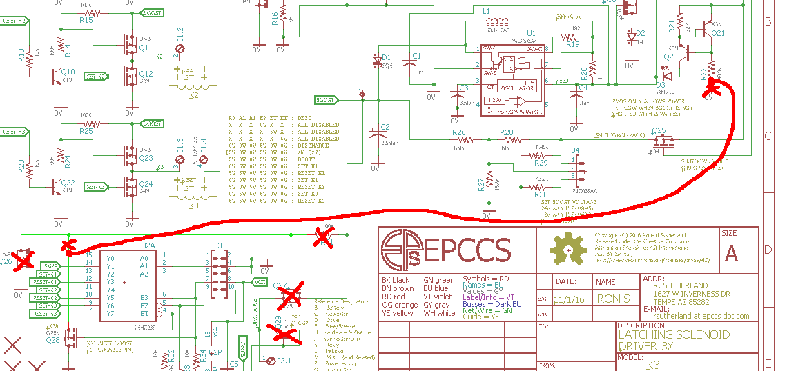
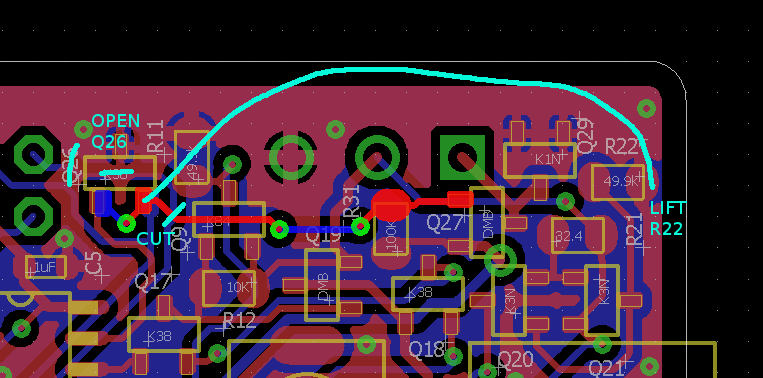

# Description

Some lessons I learned doing K3.

# Table Of Contents:

1. [^1 Enable Current Source](#1-enable-current-source)

## ^1 Enable Current Source

To save power I want to be able to turn off the test current when not using the boost supply. 

Also, I'm going to ditch the external PMOS, the storage power can be discharged on a coil, and it is not a general purpose supply.

