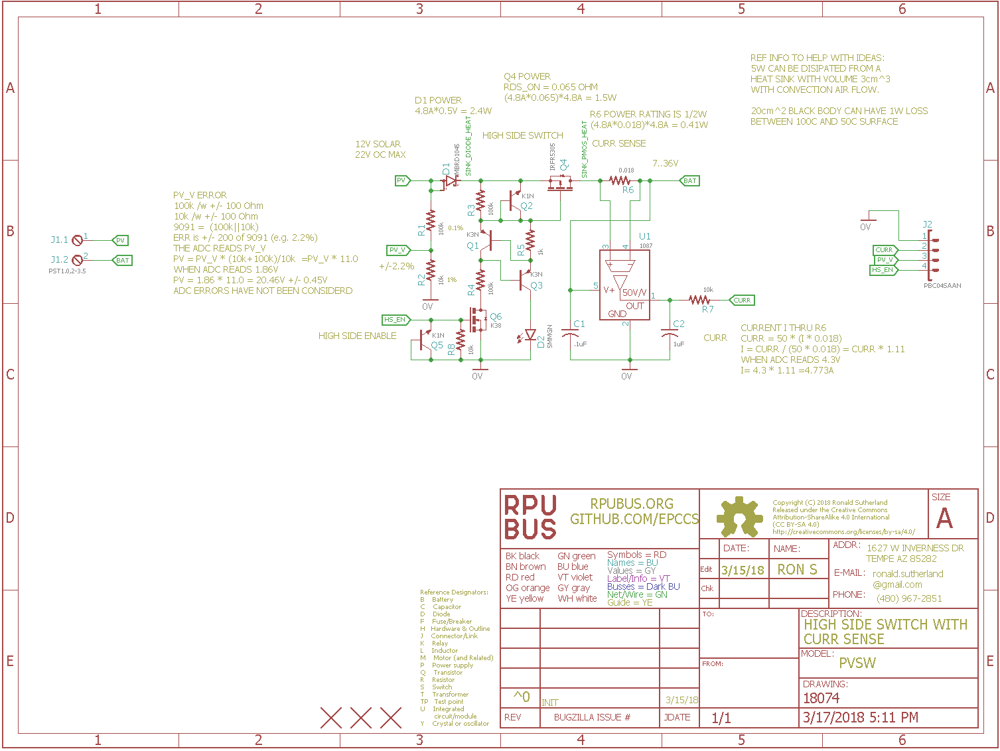

# PVsw Hardware

## Overview

A high side current sense and PMOS switch for use with 12V solar panel.


## Inputs/Outputs/Functions

```
        12V solar panels with 22V open circuit voltage 
        High Side Enable is logic high above 2.7V and low bellow 0.5V
        CURRent sense is 4% accurate from a 3% ZXCT1087 that measures a 1% 0.0.018 high side shunt.
        Solar panel voltage (PV_V) is 2.2% accurate from a divider with a 0.1% 100k and a 1% 10k.
```


## Uses

```
        Connect a 4A solar panel to a 40AHr LA battery and control with RPUlux.
```


# Table Of Contents

1. [Status](#status)
2. [Design](#design)
3. [Bill of Materials](#bill-of-materials)
4. [How To Use](#how-to-use)


# Status


```
        ^0  Done: Design, Layout, BOM,
            WIP: Review*,
            Todo: Order Boards, Assembly, Testing, Evaluation.
            *during review the Design may change without changing the revision.
```

Debugging and fixing problems i.e. [Schooling](./Schooling/)

Setup and methods used for [Evaluation](./Evaluation/)


# Design

The board is 0.063 thick, FR4, two layer, 1 oz copper with ENIG (gold) finish.


## Electrical Schematic



## Testing

Check correct assembly and function with [Testing](./Testing/)


# Bill of Materials

The BOM is a CVS file(s), import it into a spreadsheet program like LibreOffice Calc (or Excel), or use a text editor.

Option | BOM's included
----- | ----- 
A. | [BRD] 
M. | [BRD] [SMD] [HDR]
W. | [BRD] [SMD] [HDR] [PLUG]

[BRD]: ./Design/18074BRD,BOM.csv
[SMD]: ./Design/18074SMD,BOM.csv
[HDR]: ./Design/18074HDR,BOM.csv
[PLUG]: ./Design/18074PLUG,BOM.csv


# How To Use

TBD

Note: a ZXCT1086 will be used at some point, but for now it is a ZXCT1087.


