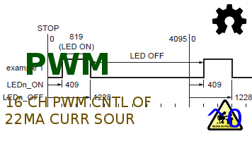
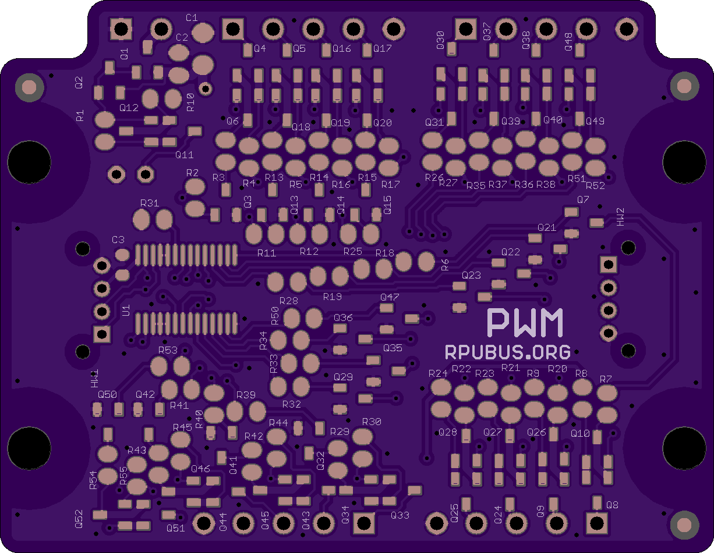
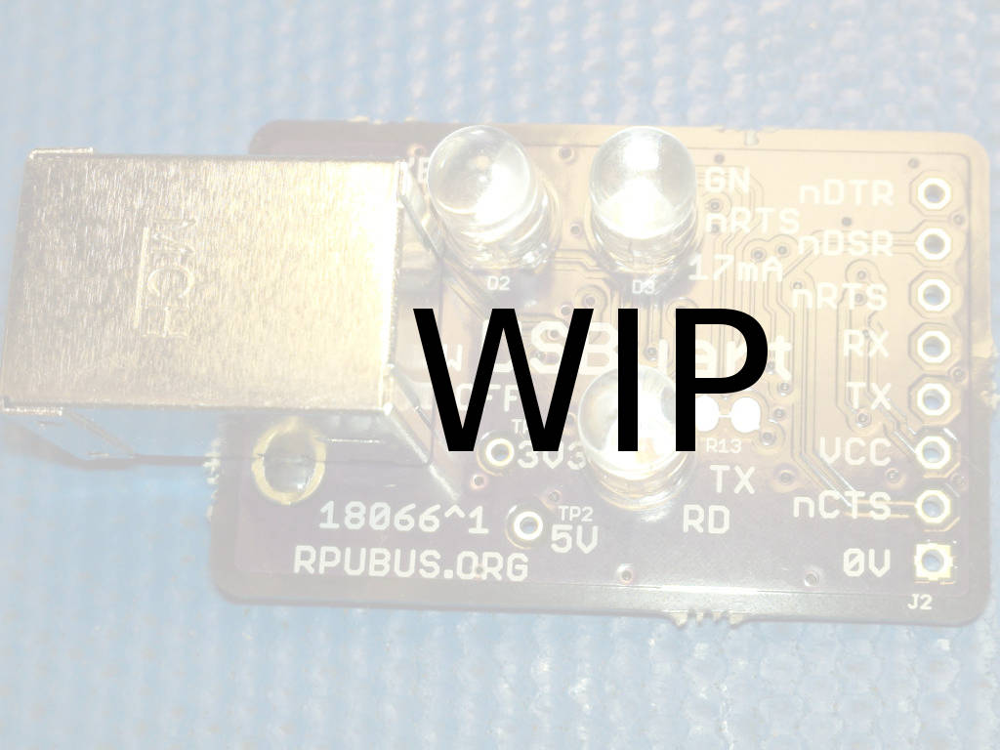
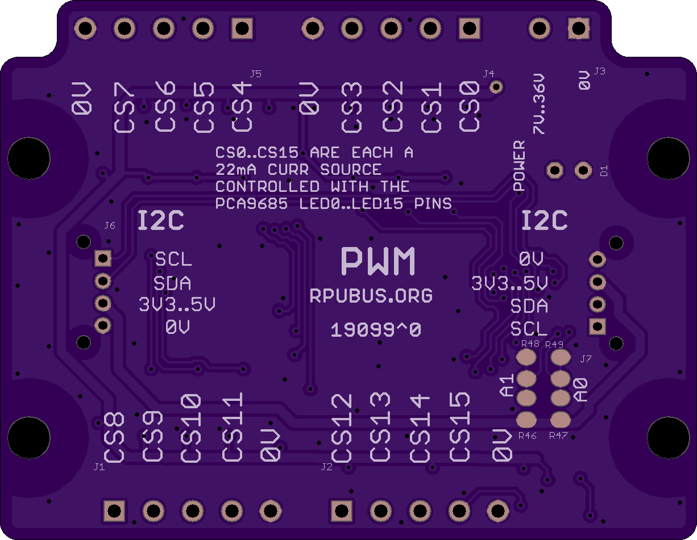
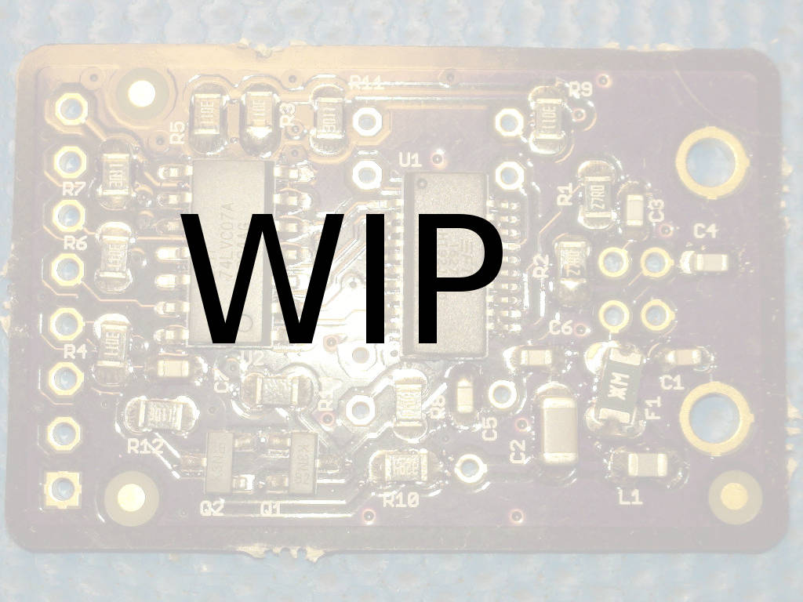
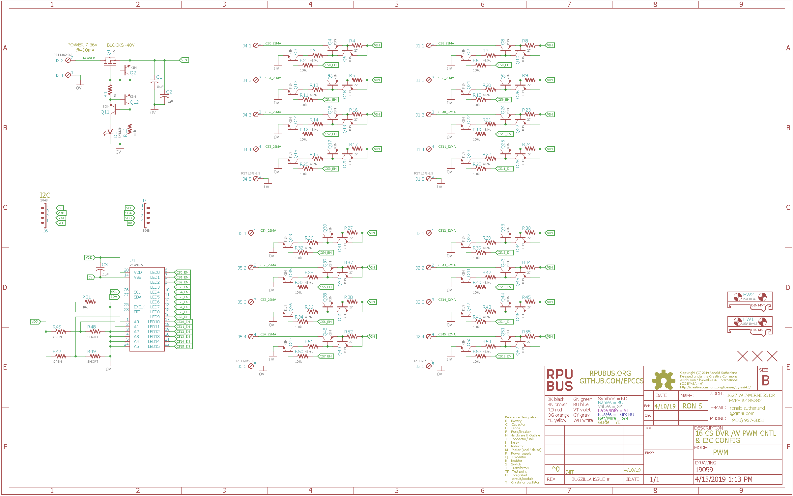

# PWM Hardware

## Overview

Sixteen 22mA current sources controled with PCA9685 over I2C
 


## Inputs/Outputs/Functions

```
        Control with I2C commands.
        Sixteen 22mA current sources with PWM control.
        Current sources fold back when they get hot.
```


## Uses

```
        LED strings.
        Current loop sensors (e.g. oscilator MT, LT, HT or analog PT, TT)
        SSR control (e.g. fan, pump, heating) with PWM
```


# Table Of Contents

1. [Status](#status)
2. [Design](#design)
3. [Bill of Materials](#bill-of-materials)
4. [How To Use](#how-to-use)


# Status

[Options](#bill-of-materials)



```
        ^0  Done: Design, Layout, BOM,
            WIP: Review*,
            Todo: Order Boards, Assembly, Testing, Evaluation.
            *during review the Design may change without changing the revision.
```

Debugging and fixing problems i.e. [Schooling](./Schooling/)

Setup and methods used for [Evaluation](./Evaluation/)


# Design

The board is 0.063 thick, FR4, two layer, 1 oz copper with ENIG (gold) finish.







## Electrical Schematic



## Testing

Check correct assembly and function with [Testing](./Testing/)


# Bill of Materials

The BOM is a CVS file(s), import it into a spreadsheet program like LibreOffice Calc (or Excel), or use a text editor.

Option | BOM's included
----- | ----- 
A. | [BRD] 
M. | [BRD] [SMD] [HDR] 
W. | [BRD] [SMD] [HDR] [PLUG]
Z. | [BRD] [SMD] [HDR] [PLUG] [DIN]

[BRD]: ./Design/19099BRD,BOM.csv
[SMD]: ./Design/19099SMD,BOM.csv
[HDR]: ./Design/19099HDR,BOM.csv
[PLUG]: ./Design/19099PLUG,BOM.csv
[DIN]: ./Design/19099DIN,BOM.csv

[Available](https://rpubus.org/Order_Form.html)


# How To Use

TBD

I have some current loop sensors that I want to measure intermittently. A 22mA constant current source can power the loop and will not damage any wires if a short occurs. The PCA9685 control allows turning off the sensors when they are not in use, and its PWM may help with other projects.  

I find that using a 22mA current source allows me to safely experiment with the control of many things without much risk of causing damage. 

This current source will foldback (reduce its output) when it gets hot. A current loop sensor should drop all the voltage so if the sensor is working the 22mA current source will not get hot. When driving LED's the amount of foldback will depend on how much voltage is on the current sources.