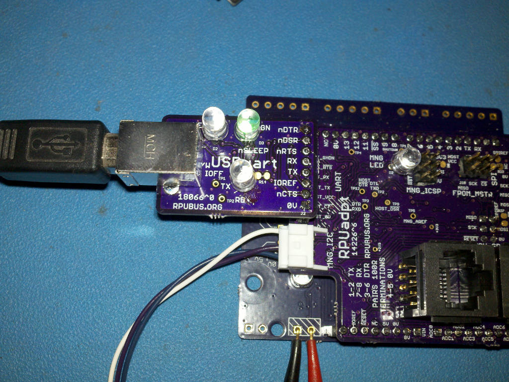

# Description

This shows the setup and methods used for evaluation of USBuart.

# Table of References


# Table Of Contents:

1. ^0 Interface With RPUadpt
1. ^0 Enumeration


## ^0 Interface With RPUadpt

[RPUadpt] has [Remote] management firmware loaded and is mounted on an [RPUno] loaded with [i2c-debug] firmware.

[RPUadpt]: https://github.com/epccs/RPUadpt/
[Remote]: https://github.com/epccs/RPUadpt/tree/master/Remote
[RPUno]: https://github.com/epccs/RPUno
[i2c-debug]: https://github.com/epccs/RPUno/tree/master/i2c-debug

Remote firmware starts up with the host lockout bit set in status, it can be changed with a host that has access or in sneaky mode (e.g. when the bus has not been managed yet). I will use /dev/ttyUSB0 which has access to the bus (through an RPUftdi at address '0').

```
picocom -b 38400 /dev/ttyUSB0
...
Terminal ready
/1/iaddr 41
{"address":"0x29"}
/1/ibuff 6,0
{"txBuffer[2]":[{"data":"0x6"},{"data":"0x0"}]}
/1/iread? 2
{"rxBuffer":[{"data":"0x6"},{"data":"0x8"}]}
/1/ibuff 7,0
{"txBuffer[2]":[{"data":"0x7"},{"data":"0x0"}]}
/1/iread? 2
{"rxBuffer":[{"data":"0x7"},{"data":"0x0"}]}
```

Connect with USBuart on /dev/ttyUSB1 

```
picocom -b 38400 /dev/ttyUSB1
...
Terminal ready
/1/id?
{"id":{"name":"I2Cdebug^1","desc":"RPUno (14140^9) Board /w atmega328p","avr-gcc":"5.4.0"}}
```




## ^0 Enumeration

Using Ubuntu 18.04

```
dmesg
...
[   70.814330] IPv6: ADDRCONF(NETDEV_CHANGE): enp2s0: link becomes ready
[12213.459395] usb 3-2: new full-speed USB device number 2 using uhci_hcd
[12213.681418] usb 3-2: New USB device found, idVendor=0403, idProduct=6015
[12213.681424] usb 3-2: New USB device strings: Mfr=1, Product=2, SerialNumber=3
[12213.681428] usb 3-2: Product: FT231X USB UART
[12213.681431] usb 3-2: Manufacturer: FTDI
[12213.681434] usb 3-2: SerialNumber: DA01M0VI
[12213.690497] ftdi_sio 3-2:1.0: FTDI USB Serial Device converter detected
[12213.690561] usb 3-2: Detected FT-X
[12213.692537] usb 3-2: FTDI USB Serial Device converter now attached to ttyUSB1
```

The message timestamp changes from 70 to 12213 at which point we see the usb enumeration. 


