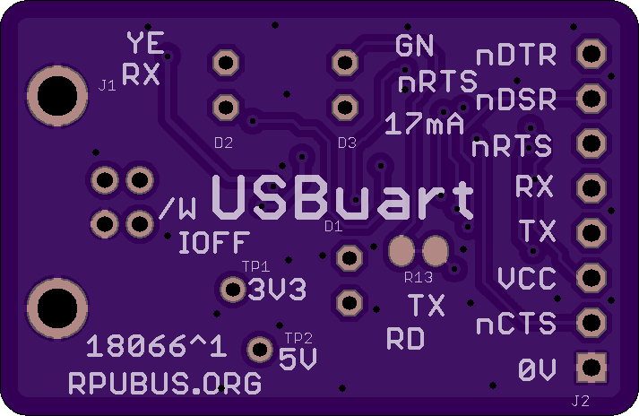

# USBuart Hardware

## Overview

The USBuart board has a FT231 USB serail bridge that is level shifted with 74LVC07A buffer for use with logic levles from 5V to 1.8V. 


## Inputs/Outputs/Functions

```
        UART lines RX, TX, nRTS, nCTS, nDTR, nDSR.
        Target side voltage controls buffer voltage if it can sink 17mA.
        17mA from USB 5V powers buffer VCC when nRTS is set active (LOW).
        Green LED shows when 17mA is powering the buffer.
```


## Uses

```
        With port closed the USBuart buffer has no power, and is in the IOFF state.
        With port closed the RPUadpt buffer has no power, and is in the IOFF state.
        When both buffers power-down, a disconnected can be done without glitching the serial bus.
```


# Table Of Contents

1. [Status](#status)
2. [Design](#design)
3. [Bill of Materials](#bill-of-materials)
4. [How To Use](#how-to-use)


# Status


```
        ^1  Done: Design, Layout, BOM, Review*, Order Boards, Assembly, Testing,
            WIP: Evaluation.
            Todo:  
            *during review the Design may change without changing the revision.
            open FT231X sleep pin so green LED can be used as part of current source bias. 
            use FT231X nRTS pin to pull down current source bias through the green LED.

        ^0  Done: Design, Layout, BOM, Review*, Order Boards, Assembly,
            WIP: Testing,
            Todo: Evaluation.
            *during review the Design may change without changing the revision.
```

Debugging and fixing problems i.e. [Schooling](./Schooling/)

Setup and methods used for [Evaluation](./Evaluation/)


# Design

The board is 0.063 thick, FR4, two layer, 1 oz copper with ENIG (gold) finish.




## Electrical Schematic


## Testing

Check correct assembly and function with [Testing](./Testing/)


# Bill of Materials

The BOM is a CVS file(s), import it into a spreadsheet program like LibreOffice Calc (or Excel), or use a text editor.

Option | BOM's included
----- | ----- 
A. | [BRD] 
M. | [BRD] [SMD] [HDR] 

[BRD]: ./Design/18066BRD,BOM.csv
[SMD]: ./Design/18066SMD,BOM.csv
[HDR]: ./Design/18066HDR,BOM.csv


# How To Use

Connect target UART to USBuart (e.g. RX to target TX and TX to target RX). The main consideration is that the Target voltage needs connecto to VCC so the 74LVC07A buffer will operate at the targets voltage level. 

When the serial port is open the green LED truns on and a current source will drive 17mA into the buffer's VCC input, it can power a buffer on the target side(e.g. see RPUadpt) but will not power a target. 

If the target has an IOFF buffer like the RPUadpt does then both buffers will enter an IOFF state and allow disconnect (or connect) without a glitch showing up in the serial. There is an ESD risk that will require a knowledgeable technician to deal with. 


