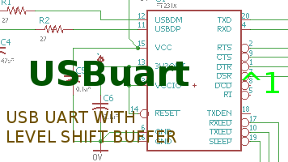

# USBuart Hardware

## Overview

The USBuart board has a FT231 USB serail bridge that is level shifted with 74LVC07A buffer for use with logic levles from 5V to 1.8V. 

## Inputs/Outputs/Functions

```
        UART lines
        Target side power controls IOFF when port is closed
```


## Uses

```
        With port closed a connection to RPUadpt does not glitch the RS422 bus.
```


# Table Of Contents

1. [Status](#status)
2. [Design](#design)
3. [Bill of Materials](#bill-of-materials)
4. [How To Use](#how-to-use)


# Status



```
        ^0  Done: Design, Layout, BOM,
            WIP: Review*,
            Todo: Order Boards, Assembly, Testing, Evaluation.
            *during review the Design may change without changing the revision.
```

Debugging and fixing problems i.e. [Schooling](./Schooling/)

Setup and methods used for [Evaluation](./Evaluation/)


# Design

The board is 0.063 thick, FR4, two layer, 1 oz copper with ENIG (gold) finish.


## Electrical Schematic


## Testing

Check correct assembly and function with [Testing](./Testing/)


# Bill of Materials

The BOM is a CVS file(s), import it into a spreadsheet program like LibreOffice Calc (or Excel), or use a text editor.

Option | BOM's included
----- | ----- 
A. | [BRD] 
M. | [BRD] [SMD] [HDR] 

[BRD]: ./Design/18066BRD,BOM.csv
[SMD]: ./Design/18066SMD,BOM.csv
[HDR]: ./Design/18066HDR,BOM.csv


# How To Use

Connect target UART to USB UART (e.g. RX to target TX and TX to target RX). The main consideration is that the Target voltage needs connecto to IOREF so the 74LVC07A buffer will operate at that voltage level. 

When the serial port is open a current source will drive 17mA into the target's IOREF input, it is not enough to power the target however it will provide bias for the buffer on RPUadpt's serial input. When the port is closed RPUadpt will have no power on its buffer which will allow both sides to set the IOFF state and thus allow connection (or disconnection) that have a minimized glitch.


