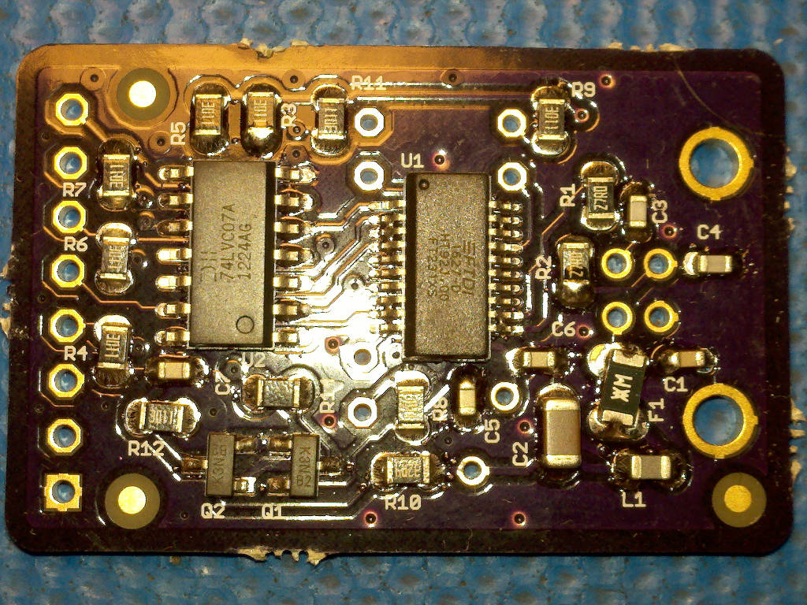

# USBuart Hardware

## Overview

The USBuart board has a FT231 USB serail bridge that is level shifted with 74LVC07A buffer for use with logic levles from 5V to 1.8V. 


## Inputs/Outputs/Functions

```
        UART lines
        Target side power controls IOFF when port is closed
        17mA from USB 5V powers IOFF buffer when port is open
        Green LED shows when port is open
```


## Uses

```
        With port closed a connection to RPUadpt does not glitch the serial bus.
```


# Table Of Contents

1. [Status](#status)
2. [Design](#design)
3. [Bill of Materials](#bill-of-materials)
4. [How To Use](#how-to-use)


# Status


```
        ^1  Done: Design, Layout, BOM, Review*, Order Boards, 
            WIP: Assembly, 
            Todo: Testing, Evaluation.
            *during review the Design may change without changing the revision.
            open FT231X sleep pin so green LED can be used as part of current source bias. 
            use FT231X nRTS pin to pull down current source bias through the green LED.

        ^0  Done: Design, Layout, BOM, Review*, Order Boards, Assembly,
            WIP: Testing,
            Todo: Evaluation.
            *during review the Design may change without changing the revision.
```

Debugging and fixing problems i.e. [Schooling](./Schooling/)

Setup and methods used for [Evaluation](./Evaluation/)


# Design

The board is 0.063 thick, FR4, two layer, 1 oz copper with ENIG (gold) finish.





## Electrical Schematic


## Testing

Check correct assembly and function with [Testing](./Testing/)


# Bill of Materials

The BOM is a CVS file(s), import it into a spreadsheet program like LibreOffice Calc (or Excel), or use a text editor.

Option | BOM's included
----- | ----- 
A. | [BRD] 
M. | [BRD] [SMD] [HDR] 

[BRD]: ./Design/18066BRD,BOM.csv
[SMD]: ./Design/18066SMD,BOM.csv
[HDR]: ./Design/18066HDR,BOM.csv


# How To Use

Connect target UART to USB UART (e.g. RX to target TX and TX to target RX). The main consideration is that the Target voltage needs connecto to VCC so the 74LVC07A buffer will operate at that voltage level. 

When the serial port is open the green LED truns on and a current source will drive 17mA into the buffer's VCC input, it can power some targets but is needed to bias the buffer on RPUadpt's serial input. When the port is closed the RPUadpt IOFF buffer will have no power which will allow both sides (e.g. both USBuart and RPUadpt have IOFF buffers) to set the IOFF state and thus allow connection (or disconnection) without a glitch. 


