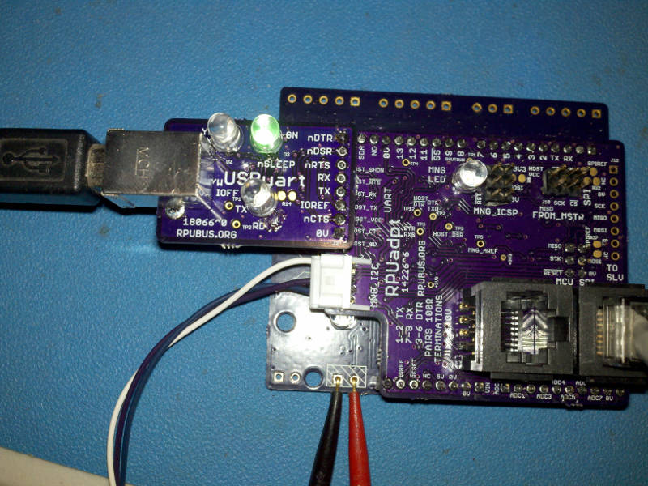

# Description

This is a list of Test preformed on each board after assembly.

# Table of References


# Table Of Contents:

1. Basics
2. Assembly check
3. IC Solder Test
4. Bias USB input
5. USB Enumeration
6. Current Source
7. Interface With RPUadpt

## Basics

These tests are for an assembled USBart board 18066^1 which may be referred to as a Unit Under Test (UUT). If the UUT fails and can be reworked then do so, otherwise it needs to be scraped. 

__Warning__: never use a soldering iron to rework ceramic capacitors due to the thermal shock.

Items used for test.



## Assembly check

After assembly check the circuit carefully to make sure all parts are soldered and correct. The device marking is labeled on the schematic and assembly drawing.


## IC Solder Test

Check that a diode drop to 0V is present from a circuit board pad that is connected to each of the pins of the IC's. Measure with a DMM's diode test. Consult the schematic to determine which pins can be skipped (e.g. ground, power rail, ...).


## Bias USB input

Setup a current limited supply with 5V and about 20mA limit. Connect it to the 5V USB input. Measure the input current.

``` 
{ "USB_IN_CURR_mA":[0.12,] }
``` 


## USB Enumeration

Using Ubuntu 18.04

```
dmesg
...
[49016.467927] usb 2-1: new full-speed USB device number 4 using uhci_hcd
[49016.686892] usb 2-1: New USB device found, idVendor=0403, idProduct=6015
[49016.686903] usb 2-1: New USB device strings: Mfr=1, Product=2, SerialNumber=3
[49016.686909] usb 2-1: Product: FT231X USB UART
[49016.686916] usb 2-1: Manufacturer: FTDI
[49016.686922] usb 2-1: SerialNumber: DN027PWA
[49016.697043] ftdi_sio 2-1:1.0: FTDI USB Serial Device converter detected
[49016.697106] usb 2-1: Detected FT-X
[49016.699085] usb 2-1: FTDI USB Serial Device converter now attached to ttyUSB0

```

note: dmesg gives a timestamp for usb enumeration. 


## Current Source

With USB power connected and FT231X enumeration done verify the current source is off by measuring voltage at J2 pin 3.

``` 
^0 the FT231X nDTR pin is pulled to 3V3 so the current source is not all the way off
{ "TARGET_OFF_V":[0.0,],
  "TARGET_OFF_mA":[0.0,]}
``` 

Open the Port

```
picocom -b 38400 /dev/ttyUSB0
```

Measure the current source

``` 
{ "TARGET_ON_V":[4.7,],
  "TARGET_ON_mA":[17.8,]}
``` 

## Interface With RPUadpt

[RPUadpt] has [Remote] management firmware loaded and is mounted on an [RPUno] loaded with [i2c-debug] firmware.

[RPUadpt]: https://github.com/epccs/RPUadpt/
[Remote]: https://github.com/epccs/RPUadpt/tree/master/Remote
[RPUno]: https://github.com/epccs/RPUno
[i2c-debug]: https://github.com/epccs/RPUno/tree/master/i2c-debug

Remote firmware starts up with the host lockout bit set in status, it can be changed with a host that has access or in sneaky mode (e.g. when the bus has not been managed yet). I will use /dev/ttyUSB0 which has access to the bus (through an RPUftdi at address '0').

```
picocom -b 38400 /dev/ttyUSB0
...
Terminal ready
/1/iaddr 41
{"address":"0x29"}
/1/ibuff 6,0
{"txBuffer[2]":[{"data":"0x6"},{"data":"0x0"}]}
/1/iread? 2
{"rxBuffer":[{"data":"0x6"},{"data":"0x8"}]}
/1/ibuff 7,0
{"txBuffer[2]":[{"data":"0x7"},{"data":"0x0"}]}
/1/iread? 2
{"rxBuffer":[{"data":"0x7"},{"data":"0x0"}]}
```

Connect with USBuart on /dev/ttyUSB1 

```
picocom -b 38400 /dev/ttyUSB1
...
Terminal ready
/1/id?
{"id":{"name":"I2Cdebug^1","desc":"RPUno (14140^9) Board /w atmega328p","avr-gcc":"5.4.0"}}
```

